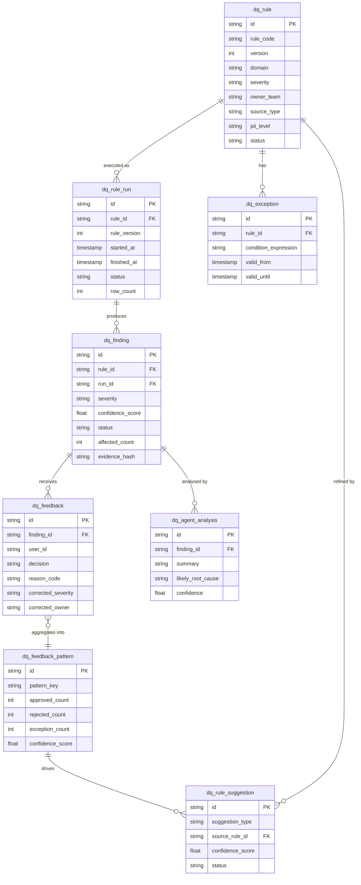
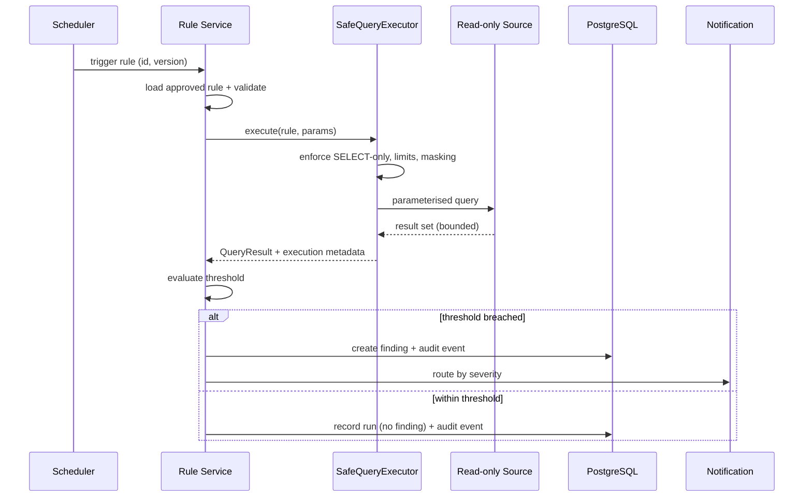
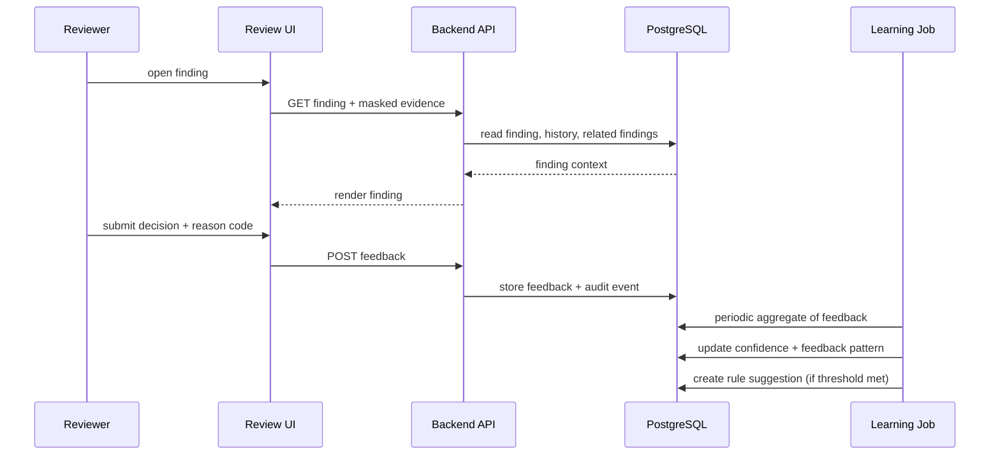

# Cerberos Data Assurance Intelligence Layer - Combined Discovery Pack

> This file combines the Confluence parent page and all child pages into one long-form reference copy.
> The authoritative source should remain the individual Confluence pages in confluence/.
> Use this combined file only for private review, export, or continuity checks.
> Generated by build-combined.sh - do not edit by hand.

This combined file contains 15 sections in total: the parent page followed by 14 child pages.

## Table of Contents

1. Initial Discovery Concept
2. Context and Problem
3. Capability and Architecture
4. Human Review and Learning Loop
5. Governance, Security, and Scale
6. PoC, Roadmap, and Risks
7. Rule Types, Data Model, and Examples
8. Logging, Observability, and Monitoring
9. JVM Agent Framework Options
10. Open Decisions and Discovery Questions
11. Technology Selection and Architecture Decision Report
12. Architecture Decision Summary
13. Executive Discovery Proposal
14. Supporting Technical Detail
15. S3, Parquet, Glue Data Catalog and Athena Analytical Assurance Layer

---
# Cerberos Data Assurance Intelligence Layer - Initial Discovery Concept

**Status:** Private working draft  
**Audience:** Architecture, platform, engineering management, delivery, and data governance stakeholders  
**Purpose:** Initial discovery discussion, not a final implementation proposal

This Confluence set is structured as one parent page plus 14 child pages (15 sections in total: this parent page followed by 14 child pages).

## Summary

Cerberos operates at very high data scale, with approximately 5 billion data events per month. In a border/security context, data quality should be treated as a platform assurance and reliability concern, not only as a reporting issue or a reactive investigation activity.

This concept explores a governed Data Assurance Intelligence Layer. The capability would run approved, read-only data quality checks against safe data sources, generate reviewable findings, capture structured human feedback, and use that feedback to improve assurance over time.

The key idea is the learning loop. The system should not only detect known data quality issues; it should learn from human approvals, rejections, corrections, exceptions, and comments to reduce false positives, improve severity classification, improve owner routing, strengthen evidence, and suggest future rule refinements.

This is not autonomous decision-making. It is governed data assurance supported by controlled automation, structured human feedback, and optional AI-assisted analysis.

This concept intentionally starts from discovery. Existing controls, data ownership, safe sources, and current assurance processes need to be understood before any implementation proposal is made. The current state is treated as unknown until validated.

## Data Quality and Data Assurance

For this discovery note:

- **Data Quality** refers to the correctness, completeness, freshness, consistency, and usability of data.
- **Data Assurance** is broader. It refers to the governed capability to detect, review, evidence, learn from, and improve confidence in data quality over time.

## Why This Matters

At Cerberos scale, poor data quality may affect:

- Identity confidence.
- Journey and event integrity.
- Downstream matching.
- Risk scoring or decision-support reliability.
- Operational assurance.
- Audit confidence.
- Reporting accuracy.
- Incident investigation time.
- Potential public safety or security assurance.

Manual investigation remains important, but it may not be sufficient as the main mechanism for assurance at this scale.

## Safe Operating Model

```text
Approved rule
    -> read-only data source
    -> controlled finding
    -> human review
    -> structured feedback
    -> governed learning
    -> human-approved rule improvement
```

The unsafe model to avoid:

```text
Agent
    -> production DB
    -> uncontrolled free query
    -> autonomous action
```

## Non-goals

This discovery concept is not:

- A replacement for existing incident processes.
- Autonomous data correction or remediation.
- Unrestricted AI access to operational or analytical data.
- A full enterprise data quality platform proposal at this stage.
- A claim that current teams or controls have failed.

## Proposed Page Structure

This discovery concept is split into the following child pages:

1. Context and Problem
2. Capability and Architecture
3. Human Review and Learning Loop
4. Governance, Security, and Scale
5. PoC, Roadmap, and Risks
6. Rule Types, Data Model, and Examples
7. Logging, Observability, and Monitoring
8. JVM Agent Framework Options
9. Open Decisions and Discovery Questions
10. Technology Selection and Architecture Decision Report
11. Architecture Decision Summary
12. Executive Discovery Proposal
13. Supporting Technical Detail
14. S3, Parquet, Glue Data Catalog and Athena Analytical Assurance Layer

## Suggested Reading Paths

This pack is layered. It is not intended to be shared in full as a first contact. Use the path that
matches the audience and the stage of the conversation.

For senior stakeholders (first share):

- Executive Discovery Proposal
- Initial Discovery Concept (this page)
- Context and Problem
- PoC, Roadmap, and Risks

For architecture review (if interest is confirmed):

- Capability and Architecture
- Governance, Security, and Scale
- S3, Parquet, Glue Data Catalog and Athena Analytical Assurance Layer

For technical implementation review (only if an implementation approach is requested):

- Technology Selection and Architecture Decision Report
- Rule Types, Data Model, and Examples
- Supporting Technical Detail
- Logging, Observability, and Monitoring
- JVM Agent Framework Options

The technical implementation pages (Technology Selection, Supporting Technical Detail, and JVM Agent
Framework Options in particular) are technical appendices. They should be kept out of the initial
stakeholder pack so the discovery does not read as implementation-ready too early.

## Initial Recommendation

The right next step is not a full platform build. The right next step is a small discovery or PoC:

- One data domain.
- One safe read-only source.
- Five approved rules.
- A simple findings store.
- A lightweight review UI.
- Structured feedback capture.
- Basic confidence scoring.
- One evidence-backed rule refinement suggestion.

The goal would be to test whether the human-in-the-loop learning model creates actionable data assurance value without production impact or governance risk.

For a shorter senior-stakeholder version, use the child page **Executive Discovery Proposal**. For a shorter technical decision view, use **Architecture Decision Summary**.

---
# Context and Problem

**Parent page:** Cerberos Data Assurance Intelligence Layer - Initial Discovery Concept  
**Status:** Private working draft

## Context

Cerberos is a large-scale border/security-related platform. It produces approximately 5 billion data events per month.

In this context, data quality should be considered a platform assurance concern. It may influence operational confidence, identity confidence, matching reliability, audit review, incident investigation, and decision-support reliability.

This does not mean every data quality issue is operationally critical. It does mean the assurance model should be proportionate to the platform context, sensitivity, and scale.

## Why Data Quality Matters Here

Data quality issues may affect:

- Identity confidence.
- Journey and event integrity.
- Downstream matching.
- Risk scoring inputs.
- Decision-support reliability.
- Reporting accuracy.
- Audit confidence.
- Incident investigation time.
- Security assurance.
- Potential public safety implications.

In ordinary reporting environments, data quality may mostly affect management information. In a border/security platform, the same class of issue may have wider assurance implications.

## Current Problem Space

There are indications that data quality may be a recurring concern, but this should be validated through discovery rather than assumed. It is not yet clear whether issues are systematically measured and proactively monitored, or mainly investigated reactively when downstream issues are noticed.

Possible current challenges:

- Data quality concerns may be discussed but not consistently quantified.
- Issues may be detected late or downstream.
- Manual SQL investigation may be repeated.
- Ownership may be unclear.
- Known exceptions may not be captured structurally.
- Previous feedback may not improve future checks.
- Hidden data quality issues may remain undetected.
- Rule-based monitoring alone only catches known problems.
- Lack of structured feedback prevents learning.

## Existing Capability Assessment

Discovery should identify:

- Existing automated data quality checks.
- Existing reconciliation reports.
- Existing dashboards.
- Current incident process for data issues.
- Current ownership model.
- Existing Athena, S3, and Glue usage.
- Existing Copilot or AI usage restrictions.
- Existing replica DB access patterns.

## Core Problem Statement

At Cerberos scale, the main challenge is not only detecting known data quality issues, but creating a governed mechanism to validate findings, capture domain feedback, and use that feedback to continuously improve data assurance.

## Discovery Questions

- What data quality checks already exist?
- Which checks are manual, automated, or embedded in reporting?
- Which issues recur most often?
- Which issues are detected too late?
- Which safe read-only sources are available for a PoC?
- Which domain has enough evidence and stakeholder support for a narrow discovery?
- Which teams would review findings and own rule quality?

---
# Capability and Architecture

**Parent page:** Cerberos Data Assurance Intelligence Layer - Initial Discovery Concept  
**Status:** Private working draft

## Proposed Capability

The Cerberos Data Assurance Intelligence Layer would run approved, controlled, read-only data quality checks against safe data sources. It would create findings, present them for human review, capture structured feedback, and use that feedback to suggest improvements over time.

It should be positioned as a platform assurance capability, not as autonomous AI.

## Core Components

- **Data Quality Rule Registry:** Versioned catalogue of approved rules, schedules, thresholds, sources, owners, PII level, and approval status.
- **Scheduler:** Triggers approved rules at defined intervals.
- **Safe Query Executor:** Runs approved query templates with guardrails, timeouts, result limits, cost limits, and audit logging.
- **Read-only Connectors:** Connects to read replicas, analytical stores, S3/Parquet datasets, Athena tables, reporting datasets, and metrics sources.
- **Findings Store:** Stores normalised findings, evidence references, severity, confidence, affected counts, and status.
- **Review UI:** Enables users and domain experts to validate findings and provide structured feedback.
- **Feedback Store:** Captures decisions, comments, corrections, reason codes, exceptions, and routing changes.
- **Learning and Insight Engine:** Analyses feedback patterns to identify refinements and hidden data quality patterns.
- **Rule Suggestion Engine:** Suggests candidate rule refinements, exceptions, and new rules for human approval.
- **Dashboard and Notifications:** Provides reporting and routes findings to owners.
- **Governance and Audit Layer:** Tracks approvals, rule versions, access, execution, and feedback.

## High-Level Architecture

```text
                       +-----------------------------+
                       | Data Quality Rule Registry  |
                       +--------------+--------------+
                                      |
                                      v
                               +------+------+
                               | Scheduler   |
                               +------+------+
                                      |
                                      v
                        +-------------+-------------+
                        | SafeQueryExecutor         |
                        | approved templates,       |
                        | limits, audit, masking    |
                        +------+--------------------+
                               |
              +----------------+----------------+
              |                                 |
              v                                 v
      +-------+--------+              +---------+---------+
      | Replica DB     |              | Athena Connector  |
      | read-only      |              | analytical checks |
      +-------+--------+              +---------+---------+
              |                                 |
              |                                 v
              |                       +---------+---------+
              |                       | Athena            |
              |                       +---------+---------+
              |                                 |
              |                                 v
              |                       +---------+---------+
              |                       | Glue Data Catalog |
              |                       +---------+---------+
              |                                 ^
              |                                 |
              |                       +---------+---------+
              |                       | Glue Crawler /    |
              |                       | metadata workflow |
              |                       +---------+---------+
              |                                 ^
              |                                 |
              |        +------------------------+-------------------+
              |        |                                            |
              |        v                                            v
              | +------+-------------+                    +---------+---------+
              | | S3 raw zone        |                    | S3 curated        |
              | | source-aligned     |                    | Parquet zone      |
              | +--------------------+                    +-------------------+
              |
              +----------------+----------------+
                               |
                               v
                        +------+------+
                        | Findings    |
                        | Store       |
                        +------+------+
                               |
                               v
                        +------+------+
                        | Review UI   |
                        +------+------+
                               |
                               v
                        +------+------+
                        | Feedback    |
                        | Store       |
                        +------+------+
                               |
                               v
                    +----------+-----------+
                    | Learning Loop        |
                    | confidence,          |
                    | backtesting,         |
                    | suggestions          |
                    +----------+-----------+
                               |
                               v
                    +----------+-----------+
                    | Human Approval       |
                    | updated rules only   |
                    +----------------------+
```

Replica DB checks and Athena analytical checks are complementary. Replica DB checks are better suited to recent, near-operational read-only checks. Athena is better suited to analytical, aggregate, historical, partition-aware checks such as reconciliation, trend analysis, schema drift, and backtesting. Athena must not be used as a low-latency user request path.

All Athena access must go through `SafeQueryExecutor`. Agents or Copilot-style assistants must never directly query Athena or S3; they may only analyse controlled, masked, bounded outputs from approved rule executions.

## End-to-End Flow

1. A rule is defined and approved.
2. The scheduler triggers the rule.
3. The Safe Query Executor validates and runs the query against a read-only source.
4. Results are normalised.
5. Thresholds are evaluated.
6. Findings are created.
7. Findings are displayed in the Review UI.
8. Users review and provide structured feedback.
9. Feedback is stored.
10. The learning engine analyses feedback.
11. The system updates confidence scores.
12. The system suggests exceptions, refinements, evidence changes, routing changes, or new rules.
13. A human owner reviews suggestions.
14. Approved changes are versioned and backtested.
15. Updated rules are deployed through governance.

Automatic rule deployment should not happen without approval.

## Initial Rule Categories

Initial rule categories include completeness, freshness, duplicate detection, referential integrity, status validation, reconciliation, schema drift, anomaly detection, cross-system consistency, and data contract validation.

Detailed examples are captured in the child page **Rule Types, Data Model, and Examples**.

Technology options for the optional agent layer are captured in the child page **JVM Agent Framework Options**.

Operational visibility for the assurance platform itself is captured in the child page **Logging, Observability, and Monitoring**.

Implementation technology choices and initial ADRs are captured in the child page **Technology Selection and Architecture Decision Report**.

The analytical data lake access pattern for S3, Parquet, Glue Data Catalog, and Athena is captured in the child page **S3, Parquet, Glue Data Catalog and Athena Analytical Assurance Layer**.

---
# Human Review and Learning Loop

**Parent page:** Cerberos Data Assurance Intelligence Layer - Initial Discovery Concept  
**Status:** Private working draft

## Why Human Review Matters

The most important part of the concept is not automation alone. It is the learning loop created by human review.

Data quality findings often require domain context. A finding may be a genuine issue, a false positive, a known exception, a duplicate, a low-impact condition, or a sign that the business rule has been misunderstood. Capturing that distinction structurally is what allows the assurance capability to improve.

## Review UI

A finding screen should show:

- Finding summary.
- Rule name and version.
- Severity.
- Confidence score.
- Affected count.
- Source system.
- Domain.
- Time window.
- Baseline comparison.
- Trend.
- Masked sample evidence.
- Related previous findings.
- Related incidents.
- Suggested owner/team.
- Suggested root cause.
- Recommended action.

## Structured Feedback

The decision panel should allow:

- Confirm issue.
- False positive.
- Known acceptable exception.
- Duplicate.
- Needs investigation.
- Wrong severity.
- Wrong owner.
- Insufficient evidence.
- Business rule misunderstood.
- Low impact.

Additional fields should include:

- Comment.
- Corrected severity.
- Corrected owner/team.
- Exception reason.
- Link to incident.
- Link to runbook.
- Create candidate exception.
- Suggest rule refinement.

Structured feedback is more useful than free text alone because it can be measured, trended, audited, and used to improve future checks.

False positive and known exception should be separated clearly:

- **False positive** means the rule is wrong or the evidence does not support the issue.
- **Known exception** means the finding is technically true, but accepted under a documented business, source, or operational condition.

## Learning Loop

```text
Finding
  -> Human decision
  -> Structured feedback
  -> Feedback pattern
  -> Learning insight
  -> Suggested improvement
  -> Human approval
  -> Improved rule
```

## What the System Learns

The learning engine may identify:

- Rules with high false positive rates.
- Sources where a rule is reliable.
- Sources where a rule is unreliable.
- Known exception patterns.
- Incorrect severity classification.
- Incorrect owner routing.
- Evidence gaps.
- Hidden patterns across source, event type, transformation version, provider, field, status, or time window.
- Candidate new rules.

Example:

> Most confirmed findings are concentrated in JOURNEY_UPDATE events from Source C after transformation version v2.14.

This type of insight does not make a decision. It gives teams a better investigation starting point.

## Agent / Copilot Role

Agents or Copilot-style capabilities may support:

- Summarising findings.
- Drafting incident descriptions.
- Suggesting likely root causes.
- Explaining potential impact.
- Suggesting owners.
- Grouping related findings.
- Analysing feedback patterns.
- Drafting rule refinements.
- Drafting candidate rules.
- Generating daily or weekly quality reports.
- Creating runbook drafts.

Agents must not:

- Write production data.
- Run uncontrolled queries.
- Make operational or security decisions.
- Expose raw PII.
- Automatically remediate.
- Automatically deploy rules.
- Bypass governance.
- Replace human review.

## AI-Assisted Suggestion Lifecycle

This is the heart of the concept. The AI/agent-assisted layer should produce suggestions only,
never decisions. Every reviewer action on a suggestion becomes feedback for future learning, so the
platform learns not only from data quality findings, but also from the quality of its own suggestions.

A suggestion may be:

- Accepted.
- Rejected.
- Edited.
- Downgraded.
- Escalated.
- Marked as not enough evidence.
- Converted into a candidate rule.
- Converted into a known exception.
- Linked to an incident or runbook.

For each suggestion, the system should track:

- Suggestion type.
- Suggested owner.
- Suggested severity.
- Suggested root cause.
- Reviewer decision.
- Reviewer correction.
- Reason code.
- Confidence before review.
- Confidence after review.
- Whether the suggestion led to a rule refinement.

```text
AI/agent suggestion
  -> human review (accept / reject / edit / downgrade / escalate)
  -> reviewer correction + reason code
  -> suggestion feedback pattern
  -> confidence adjustment (before vs after review)
  -> improved routing, severity, evidence, or rule refinement
  -> human approval
```

This closes the loop twice: once on the data quality finding, and once on the suggestion itself. Over
time the platform can tell which suggestion types are reliable, which need more evidence, and which
should be suppressed. A worked accept/reject/edit example is in the child page
**Rule Types, Data Model, and Examples**.

## Key Principle

This follows the safe operating model defined on the parent page
**Cerberos Data Assurance Intelligence Layer - Initial Discovery Concept**, with the detailed
governance, security, and privacy controls captured in **Governance, Security, and Scale**.

Supporting rule examples and the conceptual data model are captured in the child page **Rule Types, Data Model, and Examples**.

Framework options for implementing the optional agent/Copilot-assisted layer are captured in the child page **JVM Agent Framework Options**.

---
# Governance, Security, and Scale

**Parent page:** Cerberos Data Assurance Intelligence Layer - Initial Discovery Concept  
**Status:** Private working draft

## Governance Principles

The capability must be governed from the start.

Principles:

- Rules are approved before execution.
- Rules are versioned.
- Findings reference the exact rule version that generated them.
- Rule changes require human approval.
- Backtesting should be performed before deployment where data is available.
- Rollback should be possible.
- Exceptions are explicit, approved, versioned, and reviewed.
- Rule owners are accountable for rule intent and quality.
- Learning produces suggestions, not automatic changes.
- Audit trails cover rule creation, execution, feedback, suggestions, approval, and deployment.

## Indicative RACI for Discovery

| Activity | Responsible | Accountable | Consulted | Informed |
| --- | --- | --- | --- | --- |
| Rule definition | Data/platform team | Rule owner | Domain SMEs | Delivery |
| Finding review | Domain SME | Data owner | Platform team | Ops |
| Rule approval | Rule owner | Architecture/Governance | Security | Delivery |
| Platform operation | Platform team | Engineering owner | DevOps/SRE | Users |

This RACI is indicative and uses generic role names (rule owner, data owner, domain SME, platform
owner, security/governance reviewer, delivery stakeholder, SRE/DevOps). The actual responsible,
accountable, consulted, and informed roles must be validated during discovery once real teams and
owners are identified.

## Security and Privacy Controls

Required controls:

- Read-only access.
- Replica-first or analytical-source-first execution.
- Approved query templates.
- No production writes.
- No uncontrolled ad-hoc queries.
- No autonomous remediation.
- RBAC and IAM integration.
- Least privilege.
- PII masking.
- Output minimisation.
- Secure storage.
- Audit logging.
- Human approval.
- Retention policy.
- Sensitive field controls.
- Query allow-list.
- Query deny-list for `UPDATE`, `DELETE`, `DROP`, `ALTER`, `TRUNCATE`, and similar operations.
- Encryption at rest and in transit.
- Security and compliance review.

Agent safety:

> Agents analyse controlled findings, structured metadata, masked evidence, and governed context. They do not receive unrestricted raw sensitive data or direct production database access.

## Data Classification Model

Each rule and finding should declare the maximum data classification it may access and the maximum classification it may output.

| Classification | Description | PoC Handling |
| --- | --- | --- |
| Public / non-sensitive metadata | Public or non-sensitive technical metadata. | May be shown in dashboards if still relevant. |
| Internal operational metadata | Source names, rule IDs, counts, timings, owners, run status. | Suitable for findings and dashboards with normal internal access controls. |
| Sensitive operational data | Operational values or context that may reveal platform behaviour. | Minimise, mask where possible, and restrict by RBAC. |
| PII / identity-related data | Identity, document, person, journey, or other individual-related data. | Do not store raw values in findings; use masking, hashes, or references. |
| Highly restricted investigation-only data | Data requiring exceptional access or case-specific investigation. | Exclude from PoC findings unless explicitly approved by governance. |

Raw rows should not be stored directly in the findings store. Findings should store aggregate evidence, masked sample references where allowed, hashes, rule/run metadata, and links to governed evidence locations.

## Retention Decisions

Retention should be agreed during discovery for:

- Findings.
- Feedback.
- Masked evidence references.
- Audit events.
- Rule execution metadata.
- Agent prompts and outputs, if enabled.
- Backtest results.
- Athena query result metadata and query execution IDs.

## S3, Glue and Athena Governance Controls

The analytical assurance layer introduces additional governance requirements for S3, Parquet, Glue Data Catalog and Athena.

Required controls:

- Separate raw and curated S3 zones with different access policies.
- Raw-zone access restricted to tightly controlled investigation and schema drift use cases.
- Curated Parquet datasets preferred for repeatable Athena DQ rules.
- Glue Crawler permitted for PoC discovery where appropriate.
- Critical curated schemas should move toward controlled Glue table definitions via IaC or an approved metadata workflow.
- Athena queries must run through `SafeQueryExecutor`, not directly from UI, agent, notebook, or arbitrary service code.
- Athena workgroups should enforce result location, encryption, and cost controls where available.
- Query execution audit should link findings to Athena query execution IDs.
- No raw PII should appear in Athena query outputs used for notifications or agent prompts.
- Agent/Copilot tooling must never directly query S3 or Athena.

## Scale Considerations

Cerberos produces approximately 5 billion events per month. The platform must avoid scanning all raw data continuously.

Recommended approaches:

- Incremental time-window checks.
- Partition-aware queries.
- Aggregate metrics.
- Precomputed counters.
- Sampling where appropriate.
- Exception-focused queries.
- Source and event-type grouping.
- Athena partition pruning.
- S3 Parquet optimisation.
- Query timeout.
- Concurrency limit.
- Cost control.
- Result row limits.
- Scheduling windows.
- Separation from production workload.

Rules should be designed to work against replicas or analytical datasets, not operational production databases.

Replica DB checks and Athena analytical checks should be treated as complementary. Replica databases are appropriate for recent operational read-only checks; S3/Parquet/Athena is appropriate for historical, aggregate, reconciliation, schema drift, and backtesting checks.

Detailed guidance is captured in **S3, Parquet, Glue Data Catalog and Athena Analytical Assurance Layer**.

## Alerting and Notification

| Severity | Suggested Handling |
| --- | --- |
| Critical | Immediate alert and ticket. |
| High | Alert within defined SLA. |
| Medium | Hourly or daily digest. |
| Low | Dashboard and reporting only. |

Alerting should include deduplication, grouping, cooldown periods, owner-based routing, and integration with Jira, ServiceNow, Teams, or Email.

Repeated findings should update an existing incident where appropriate rather than creating unnecessary duplicates.

## Dashboard Views

Executive view:

- Overall data assurance score.
- Active critical findings.
- Findings by domain.
- Findings by source system.
- Findings by owner/team.
- Issue age.
- Confirmed versus rejected findings.
- Learning suggestions pending approval.

Technical view:

- Freshness status.
- Duplicate rate.
- Missing field rate.
- Reconciliation gaps.
- Schema drift events.
- False positive rate.
- Rule confidence score.
- Top recurring issues.
- Rule run history.
- Evidence quality feedback.

---
# PoC, Roadmap, and Risks

**Parent page:** Cerberos Data Assurance Intelligence Layer - Initial Discovery Concept  
**Status:** Private working draft

## Example Scenario

Scenario: missing nationality spike from CarrierGateway-A.

1. A rule detects a missing nationality rate of 7.2% in the last hour.
2. The normal baseline is below 0.3%.
3. A High severity finding is created.
4. The UI shows affected count, source, time window, trend, baseline, and masked evidence.
5. A user confirms the issue and links it to a recent transformation deployment.
6. Feedback is stored.
7. The learning engine correlates the finding with similar confirmed issues.
8. A pattern is identified around source, event type, and transformation version.
9. A candidate rule refinement is suggested.
10. A human owner reviews and approves the refinement after backtesting.
11. Future detection improves.

## Possible PoC Scope

The PoC should be deliberately small. This page is the canonical PoC scope for the discovery pack.

Scope:

- One data domain.
- One safe read-only data source.
- Five approved rules.
- One findings store.
- One simple review UI.
- Confirm, reject, and reclassify feedback.
- Basic confidence scoring.
- One rule refinement suggestion.
- One candidate new rule suggestion.
- Daily summary report.
- No production writes.
- No automated remediation.
- No uncontrolled AI access.

Candidate PoC rules:

1. Missing mandatory identity field.
2. Source freshness check.
3. Duplicate external reference.
4. Broken journey-person reference.
5. Inbound versus processed reconciliation.

## Success Criteria

- Known issue detected.
- False positive rate measured.
- User feedback captured structurally.
- Rule confidence calculated.
- At least one useful rule refinement suggested.
- No production impact.
- Output considered actionable by users.

## Measurable Success Metrics

Potential PoC measures:

- Percentage of findings reviewed within the agreed SLA.
- False positive rate measured by rule and source.
- Number of confirmed issues detected.
- Number of repeated manual investigations reduced or shortened.
- Average time to triage a finding.
- Number of useful rule refinements suggested.
- Athena scan cost per analytical rule.
- Zero production-impact incidents caused by the PoC.

## Risks and Mitigations

| Risk | Mitigation |
| --- | --- |
| Perceived as AI overreach | Position as governed platform assurance, not autonomous AI. |
| Security or privacy concerns | Use read-only sources, PII masking, least privilege, audit logging, and review. |
| Production performance impact | Use replicas, analytical datasets, bounded windows, and cost controls. |
| False positives | Capture feedback, track confidence, and backtest refinements. |
| Alert fatigue | Deduplicate, group, use cooldowns, and route lower severity findings to digest. |
| Unclear ownership | Capture corrected owner feedback and maintain rule owner accountability. |
| Lack of user engagement | Start with one domain and a lightweight review process. |
| Sensitive data exposure | Use masked samples, evidence hashes, output minimisation, and RBAC. |
| Organisational resistance | Mature privately and frame as discovery rather than criticism. |
| Scope becoming too large | Keep PoC narrow and defer advanced intelligence. |

## Phased Roadmap

### Phase 0 - Private Concept Maturity

- Document the idea.
- Collect observations.
- Identify examples.
- Avoid premature publication.

### Phase 1 - Discovery

- Understand current DQ issues.
- Map existing checks.
- Identify safe data sources.
- Identify stakeholders.
- Define PoC candidate.

### Phase 2 - Minimal PoC

- One domain.
- Five rules.
- Findings store.
- Simple UI.
- Feedback capture.
- Basic reporting.

### Phase 3 - Learning Loop

- Confidence scoring.
- Feedback pattern analysis.
- Known exception discovery.
- Rule refinement suggestions.

### Phase 4 - Platformisation

- Rule registry.
- Scheduler.
- RBAC.
- Audit.
- Dashboards.
- Notification integration.

### Phase 5 - Advanced Intelligence

- Anomaly detection.
- Deployment correlation.
- Schema drift correlation.
- Owner routing learning.
- Candidate rule generation.
- Agent-assisted summaries.

### Phase 6 - Controlled Remediation Support

- Remediation suggestions only.
- Human approval.
- Runbook integration.
- No autonomous data correction.

## Rollout Gates

Wider rollout should only be considered after explicit gates:

| Gate | Meaning |
| --- | --- |
| Gate 1 | Discovery validated: current capability, safe sources, and target domain are understood. |
| Gate 2 | Safe source approved: read-only replica or analytical source access is approved. |
| Gate 3 | PoC rules approved: rule owners, thresholds, evidence model, and review process are agreed. |
| Gate 4 | PoC value demonstrated: reviewed findings show actionable value without production impact. |
| Gate 5 | Security and governance approval: wider rollout controls, retention, ownership, and audit are approved. |

## Strategic Positioning

This concept should be positioned as a discovery topic, not as a final implementation proposal. The safest framing is platform assurance: approved read-only checks, human-reviewed findings, structured feedback, and governed learning.

Recommended positioning:

- Treat data quality as a platform assurance concern.
- Emphasise Cerberos scale and the border/security context.
- Avoid presenting the idea as autonomous AI.
- Avoid implying that existing teams or controls have failed.
- Start with a small read-only PoC.
- Use evidence from reviewed findings before proposing wider platformisation.

Suggested summary:

> Given Cerberos scale and the border/security context, data quality may need to be treated as a continuously improving assurance capability. The opportunity is not only to detect known issues, but to learn from reviewed findings and surface hidden data quality patterns over time.

---
# Rule Types, Data Model, and Examples

**Parent page:** Cerberos Data Assurance Intelligence Layer - Initial Discovery Concept  
**Status:** Private working draft  
**Purpose:** Supporting technical detail for the initial discovery concept

## Rule Categories

This page provides example rule categories, a conceptual data model, and sample rule definitions. The examples are illustrative and would need validation against actual Cerberos data structures, governance requirements, and safe read-only sources.

Rules may run against different safe source patterns:

- Replica DB rules for recent operational checks such as freshness, referential integrity, status validation, and short-window consistency.
- Athena analytical rules for historical, aggregate, partition-aware checks such as reconciliation, baseline comparison, schema drift, trend analysis, and backtesting.

SQL examples are illustrative only. Dialect should be adapted for PostgreSQL, Oracle, SQL Server, Athena/Presto, or the approved source technology as appropriate. These examples are not intended to be copied directly into production rule definitions without source-specific validation against actual table names, column types, and partition columns.

Athena rules must still be approved rule executions. They must go through `SafeQueryExecutor`, use partition constraints and cost controls, and must not be generated or executed directly by an agent. Detailed analytical guidance is captured in **S3, Parquet, Glue Data Catalog and Athena Analytical Assurance Layer**.

## 1. Completeness Checks

Completeness checks detect missing mandatory or conditionally mandatory fields such as document number, nationality, date of birth, journey reference, event timestamp, source event ID, or carrier reference.

Example:

```sql
select
  source_system,
  event_type,
  count(*) as affected_count
from journey_identity_events
where event_timestamp >= :window_start
  and event_timestamp < :window_end
  and (
    document_number is null
    or nationality is null
    or date_of_birth is null
  )
group by source_system, event_type
having count(*) > :minimum_affected_count;
```

## 2. Freshness Checks

Freshness checks detect whether source systems are still sending expected data within expected time windows.

Example:

```sql
select
  source_system,
  max(event_timestamp) as latest_event_timestamp,
  date_diff('minute', max(event_timestamp), current_timestamp) as minutes_since_last_event
from inbound_event_store
where source_system = :source_system
group by source_system
having date_diff('minute', max(event_timestamp), current_timestamp) > :freshness_threshold_minutes;
```

## 3. Duplicate Detection

Duplicate checks identify duplicate journeys, events, external references, identity records, or idempotency failures.

Example:

```sql
select
  external_reference,
  source_system,
  count(*) as duplicate_count
from journey_events
where event_timestamp >= :window_start
  and event_timestamp < :window_end
group by external_reference, source_system
having count(*) > 1;
```

## 4. Referential Integrity

Referential integrity checks detect records that reference missing parent entities, such as journey events without a journey or status records without the relevant business entity.

Example:

```sql
select
  e.event_id,
  e.journey_id,
  e.source_system
from journey_event e
left join journey j on e.journey_id = j.journey_id
where e.event_timestamp >= :window_start
  and e.event_timestamp < :window_end
  and j.journey_id is null;
```

## 5. Status Transition Validation

Status transition checks detect invalid lifecycle transitions, such as `PROCESSED` without `VALIDATED`, `COMPLETED` after `FAILED`, or `ARCHIVED` without required intermediate state.

Example:

```sql
select
  entity_id,
  previous_status,
  current_status,
  transition_timestamp
from entity_status_transitions
where transition_timestamp >= :window_start
  and transition_timestamp < :window_end
  and concat(previous_status, '->', current_status) not in (
    'RECEIVED->VALIDATED',
    'VALIDATED->PROCESSED',
    'PROCESSED->COMPLETED',
    'FAILED->RETRIED',
    'COMPLETED->ARCHIVED'
  );
```

## 6. Reconciliation Checks

Reconciliation checks compare counts across pipeline stages, such as inbound count, processed count, stored count, archived count, and downstream count.

Example:

```sql
select
  source_system,
  inbound_count,
  processed_count,
  stored_count,
  abs(inbound_count - processed_count) as inbound_processed_gap
from dq_pipeline_counts
where window_start = :window_start
  and window_end = :window_end
  and abs(inbound_count - processed_count) > :allowed_gap;
```

At Cerberos scale, reconciliation rules should usually prefer aggregate counts and windowed metrics. Athena over curated Parquet datasets is a strong fit for historical reconciliation, while replica DBs remain useful for recent operational checks.

## 7. Schema Drift and Data Contract Checks

Schema drift and data contract checks detect changes in field names, types, formats, enum values, payload shape, or source contract compliance.

Example:

```sql
select
  source_system,
  field_name,
  observed_type,
  expected_type,
  count(*) as occurrence_count
from observed_payload_schema
where observation_timestamp >= :window_start
  and observation_timestamp < :window_end
  and observed_type <> expected_type
group by source_system, field_name, observed_type, expected_type;
```

For S3-backed datasets, schema drift should not be hidden by uncontrolled crawler updates. Glue Crawler can support PoC discovery, but critical curated schemas should be governed through controlled Glue table definitions or an approved metadata workflow.

## 8. Anomaly and Cross-System Consistency Checks

Anomaly checks detect unusual source volumes, missing-rate spikes, abnormal duplicate rates, or sudden drops in events. Cross-system checks compare operational, archive, reporting, and downstream datasets.

Example:

```sql
select
  source_system,
  event_type,
  current_hour_count,
  baseline_hourly_avg,
  baseline_hourly_stddev
from dq_volume_baseline
where window_start = :window_start
  and current_hour_count < baseline_hourly_avg - (3 * baseline_hourly_stddev);
```

Historical baselines and cross-system consistency checks are often better suited to S3/Parquet/Athena than replica DBs, provided queries are partition-aware, bounded, audited, and cost-controlled.

## Conceptual Data Model

### dq_rule

- `id`
- `rule_code`
- `version`
- `name`
- `domain`
- `description`
- `severity`
- `owner_team`
- `query_template`
- `schedule`
- `threshold_config`
- `source_type`
- `pii_level`
- `enabled`
- `status`
- `created_by`
- `approved_by`
- `created_at`
- `updated_at`

### dq_rule_run

- `id`
- `rule_id`
- `rule_version`
- `started_at`
- `finished_at`
- `status`
- `execution_time_ms`
- `source`
- `row_count`
- `error_message`
- `cost_estimate_units`
- `audit_reference`

### dq_finding

- `id`
- `rule_id`
- `rule_version`
- `run_id`
- `severity`
- `confidence_score`
- `status`
- `domain`
- `source_system`
- `event_type`
- `affected_count`
- `finding_summary`
- `evidence_hash`
- `sample_reference_masked`
- `first_detected_at`
- `last_seen_at`
- `assigned_team`
- `incident_reference`

### dq_feedback

- `id`
- `finding_id`
- `user_id`
- `decision`
- `reason_code`
- `comment`
- `corrected_severity`
- `corrected_owner`
- `is_known_exception`
- `created_at`

### dq_feedback_pattern

- `id`
- `pattern_key`
- `rule_id`
- `domain`
- `source_system`
- `event_type`
- `decision_summary`
- `approved_count`
- `rejected_count`
- `exception_count`
- `confidence_score`
- `last_updated_at`

### dq_rule_suggestion

- `id`
- `suggestion_type`
- `source_rule_id`
- `proposed_rule_yaml`
- `reason`
- `confidence_score`
- `supporting_findings`
- `backtest_result`
- `status`
- `reviewed_by`
- `reviewed_at`

### dq_exception

- `id`
- `rule_id`
- `rule_version`
- `domain`
- `source_system`
- `condition_expression`
- `reason`
- `approved_by`
- `valid_from`
- `valid_until`

### dq_agent_analysis

- `id`
- `finding_id`
- `summary`
- `impact`
- `likely_root_cause`
- `recommended_actions`
- `confidence`
- `generated_at`

### dq_metric_snapshot

- `id`
- `metric_name`
- `domain`
- `source_system`
- `value`
- `window_start`
- `window_end`
- `created_at`

### dq_audit_event

- `id`
- `event_type`
- `entity_type`
- `entity_id`
- `rule_id`
- `rule_version`
- `actor`
- `action`
- `detail`
- `correlation_id`
- `created_at`

This conceptual data model is the authoritative table set for the discovery concept. Other pages
(such as **Technology Selection and Architecture Decision Report** and the ER diagram in
**Supporting Technical Detail**) reference subsets of these tables for illustration.

## Approved Rule Example

Rule definitions use a single canonical flat structure. The same structure is used in
**Technology Selection and Architecture Decision Report** and is validated by the JSON Schema in
**Supporting Technical Detail**. Top-level keys are flat (for example `source_type`, `owner_team`,
`query`), rule IDs follow the pattern `CERB-DQ-<number>`, and optional blocks
(`evidence`, `agent_action`, `notification`, `governance`) are explicitly allowed by the schema.

```yaml
id: CERB-DQ-101
version: 1
name: Missing critical identity fields by source system
domain: identity
description: >
  Detects journey identity events where one or more critical identity fields
  are missing after the expected ingestion and validation window.
severity: HIGH
source_type: athena
source_name: analytical_events.journey_identity_events
query_type: aggregate
schedule: hourly_with_15m_delay
owner_team: identity-data-platform
escalation_team: platform-assurance
pii_level: masked_samples_only
classification:
  max_input_classification: pii_identity_related
  max_output_classification: internal_operational_metadata
query: |
  SELECT source_system, event_type,
         COUNT(*) AS total_count,
         SUM(CASE WHEN document_number IS NULL
                    OR nationality IS NULL
                    OR date_of_birth IS NULL
                  THEN 1 ELSE 0 END) AS affected_count,
         100.0 * SUM(CASE WHEN document_number IS NULL
                            OR nationality IS NULL
                            OR date_of_birth IS NULL
                          THEN 1 ELSE 0 END) / NULLIF(COUNT(*), 0) AS missing_rate_percent
  FROM journey_identity_events
  WHERE event_timestamp >= :window_start
    AND event_timestamp <  :window_end
  GROUP BY source_system, event_type
  HAVING SUM(CASE WHEN document_number IS NULL
                    OR nationality IS NULL
                    OR date_of_birth IS NULL
                  THEN 1 ELSE 0 END) > :minimum_affected_count;
threshold:
  expression: affected_count > 100 AND missing_rate_percent > 1.0
result_limits:
  max_rows: 1000
  timeout_seconds: 60
evidence:
  sample_mode: masked
  max_samples: 20
  include_baseline: true
  include_recent_deployments: true
agent_action:
  enabled: true
  allowed_actions:
    - summarise_finding
    - suggest_possible_owner
    - compare_with_previous_findings
  prohibited_actions:
    - run_uncontrolled_query
    - expose_raw_pii
    - remediate
notification:
  severity_routing:
    CRITICAL: teams_and_ticket
    HIGH: teams_and_ticket
    MEDIUM: daily_digest
    LOW: dashboard_only
governance:
  requires_masking: true
  allow_raw_samples: false
  requires_human_approval: true
```

## Candidate Rule Suggested by Learning Engine

```yaml
id: candidate-dq-rule-processing-014
suggestion_type: new_rule
source_rule_id: CERB-DQ-003
name: Processed records missing processed timestamp
domain: Journey Processing
description: >
  Detects records that have reached PROCESSED status but do not have a
  populated processed_timestamp after the standard processing delay.
reason: >
  Multiple confirmed findings indicate downstream reconciliation gaps where
  records are marked as PROCESSED but cannot be reliably ordered or audited
  because processed_timestamp is missing.
confidence_score: 0.82
supporting_findings:
  - dq-finding-2026-05-12-01984
  - dq-finding-2026-05-18-02213
  - dq-finding-2026-05-25-02877
backtest_result:
  tested_windows: 28
  historical_findings: 19
  matched_confirmed_issues: 16
  likely_false_positives: 2
  missed_confirmed_issues: 1
requires_human_approval: true
status: pending_review
```

## Agent Suggestion Review Example

This example shows the suggestion lifecycle described in **Human Review and Learning Loop**: an
agent proposes an owner, severity, and root cause; a reviewer edits it; and the correction is fed
back into routing and confidence learning. The suggestion is advisory only and still requires human
approval before any rule change.

```yaml
suggestion_id: dq-suggestion-2026-06-001
finding_id: dq-finding-2026-06-001
suggestion_type: owner_routing
agent_suggestion:
  suggested_owner: identity-data-platform
  suggested_severity: HIGH
  suggested_root_cause: "Possible transformation issue after v2.14 deployment"
  confidence_before_review: 0.71
reviewer_decision:
  status: edited
  corrected_owner: ingestion-platform-team
  corrected_severity: MEDIUM
  reason_code: wrong_owner
  comment: "Volume drop originates upstream at ingestion, not in identity transforms."
learning_action:
  update_owner_routing_pattern: true
  update_confidence_for_source_event_pattern: true
  confidence_after_review: 0.58
  led_to_rule_refinement: false
requires_human_approval: true
```

The `reason_code` values reuse the structured feedback options defined in
**Human Review and Learning Loop** (for example `wrong_owner`, `wrong_severity`,
`insufficient_evidence`). Tracking confidence before and after review lets the platform measure the
quality of its own suggestions over time, not only the quality of the underlying findings.

## Why This Model Supports Governance

The model keeps findings linked to rule versions, execution runs, sources, evidence references, feedback decisions, and suggestions. This supports auditability, trend analysis, false positive reduction, exception governance, owner routing improvement, and human-approved rule evolution.

---
# Logging, Observability, and Monitoring

**Parent page:** Cerberos Data Assurance Intelligence Layer - Initial Discovery Concept  
**Status:** Private working draft

## Why Observability Matters

The Data Assurance Intelligence Layer monitors other systems for data quality. But who monitors the monitor?

Without structured observability, the platform cannot answer:

- Is a rule failing silently?
- Is the scheduler running on time?
- Are queries taking longer than expected?
- Is the findings store growing beyond capacity?
- Did a connector lose access to a replica?
- Is the learning engine producing stale suggestions?
- Are alerts being delivered?

A data assurance system that is itself unobservable is a liability, not an asset.

## Logging Strategy

### Log Categories

| Category | Purpose | Examples |
| --- | --- | --- |
| Rule Execution | Track each rule run lifecycle | Rule started, query submitted, query completed, threshold evaluated, finding created/not created |
| Scheduler | Track scheduling reliability | Rule triggered, rule skipped, schedule drift, backlog depth |
| Query Execution | Track query performance and safety | Query duration, rows scanned, rows returned, cost estimate, timeout, error |
| Connector Health | Track data source availability | Connection established, connection lost, reconnect attempt, auth failure |
| Feedback Capture | Track user interaction | Feedback submitted, decision recorded, exception created |
| Learning Engine | Track learning pipeline | Pattern analysis started, pattern detected, suggestion generated, suggestion expired |
| Notification Delivery | Track alert reliability | Alert sent, alert delivered, alert failed, delivery latency |
| Governance Actions | Track approval workflow | Rule approved, rule rejected, rule deployed, rule rolled back |
| Agent Activity | Track AI-assisted analysis | Agent invoked, agent response generated, agent guardrail triggered |
| System Health | Track platform internals | Memory usage, queue depth, dead letter events, error rates |

### Log Structure

All logs should follow a consistent structured format:

```json
{
  "timestamp": "2026-06-15T10:32:14.221Z",
  "level": "INFO",
  "service": "dq-rule-executor",
  "component": "safe-query-executor",
  "trace_id": "abc-123-def-456",
  "correlation_id": "rule-run-2026-06-15-00412",
  "rule_id": "dq-rule-identity-001",
  "rule_version": 3,
  "domain": "Identity",
  "source_system": "CarrierGateway-A",
  "event": "QUERY_COMPLETED",
  "duration_ms": 4230,
  "rows_returned": 847,
  "cost_estimate_units": 12.4,
  "message": "Rule query completed within threshold"
}
```

### Log Levels

| Level | Usage |
| --- | --- |
| ERROR | Unrecoverable failure requiring attention (query crash, connector auth failure, store write failure) |
| WARN | Degraded condition (query near timeout, high cost, retry triggered, stale data detected) |
| INFO | Normal operational event (rule started, finding created, feedback recorded) |
| DEBUG | Detailed trace for troubleshooting (query plan, threshold calculation, confidence adjustment) |

### PII in Logs

Logs must not contain raw PII. Any identifiers in log output should be:

- Hashed or tokenised.
- Replaced with masked references.
- Limited to aggregate counts.

This aligns with the overall platform principle of output minimisation.

## Metrics

### Key Metrics to Collect

**Rule Execution Metrics:**

- `dq.rule.execution.count` - Total rule executions (by rule, domain, source)
- `dq.rule.execution.duration_ms` - Query execution time (p50, p95, p99)
- `dq.rule.execution.success_rate` - Successful runs / total runs
- `dq.rule.execution.timeout_count` - Queries that hit timeout
- `dq.rule.execution.cost_units` - Query cost per execution
- `dq.rule.execution.rows_scanned` - Data volume per query

**Finding Metrics:**

- `dq.finding.created.count` - Findings created (by severity, domain, source)
- `dq.finding.open.count` - Currently open findings
- `dq.finding.age_hours` - Time since finding created without resolution
- `dq.finding.false_positive_rate` - Rejected findings / total findings (per rule)

**Feedback Metrics:**

- `dq.feedback.submitted.count` - Feedback events (by decision type)
- `dq.feedback.time_to_review_hours` - Time from finding creation to first feedback
- `dq.feedback.exception_rate` - Exceptions created / total feedback

**Learning Metrics:**

- `dq.learning.suggestions.count` - Suggestions generated
- `dq.learning.suggestions.approved_rate` - Approved / total reviewed
- `dq.learning.confidence_drift` - Confidence score changes over time

**Platform Health Metrics:**

- `dq.scheduler.drift_seconds` - Difference between expected and actual trigger time
- `dq.scheduler.backlog_depth` - Rules waiting to execute
- `dq.connector.health` - 1 (healthy) or 0 (unhealthy) per source
- `dq.notification.delivery_latency_ms` - Time from finding to alert delivery
- `dq.notification.failure_count` - Failed alert deliveries
- `dq.store.write_latency_ms` - Finding/feedback store write time
- `dq.store.size_gb` - Storage growth

## Tracing

Distributed tracing should link:

```text
Schedule trigger
  -> Rule execution
  -> Query submission
  -> Result processing
  -> Threshold evaluation
  -> Finding creation
  -> Notification dispatch
  -> User review
  -> Feedback capture
  -> Learning analysis
```

Each trace should carry a `correlation_id` (typically the `rule_run_id`) so that any step in the pipeline can be investigated end-to-end.

## Monitoring and Alerting (Self-Monitoring)

### Health Checks

| Check | Frequency | Alert Condition |
| --- | --- | --- |
| Scheduler heartbeat | Every minute | No heartbeat for 5 minutes |
| Connector availability | Every 5 minutes | Source unreachable for 2 consecutive checks |
| Findings store write test | Every 5 minutes | Write failure or latency > 5s |
| Rule execution backlog | Every minute | Backlog > 50 rules or > 30 minutes old |
| Query cost accumulation | Hourly | Hourly cost exceeds budget threshold |
| Notification delivery | Per alert | Delivery failure or latency > SLA |
| Dead letter queue depth | Every minute | DLQ depth > 0 for more than 10 minutes |

### Self-Monitoring Alerts

| Condition | Severity | Action |
| --- | --- | --- |
| Rule executor down | Critical | Page on-call team |
| Multiple connectors failing | High | Alert platform team |
| Scheduler drift > 15 minutes | High | Alert platform team |
| Query cost spike (3x normal) | High | Alert and pause non-critical rules |
| Finding store write failures | Critical | Page on-call, halt new executions |
| Learning engine stale (no output for 7 days) | Low | Dashboard flag |
| Notification delivery failure rate > 10% | Medium | Alert notification owner |

## Dashboards

### Platform Operations Dashboard

- Rule execution success/failure over time.
- Average and p99 query duration.
- Scheduler backlog and drift.
- Connector health status map.
- Cost accumulation (daily, weekly, monthly).
- Error rate by component.
- Dead letter queue depth.

### Data Assurance Effectiveness Dashboard

- Findings created vs confirmed vs rejected.
- False positive rate trend (per rule, per domain).
- Mean time to review.
- Confidence score distribution.
- Learning suggestions generated vs approved.
- Top recurring issues.
- Coverage: domains and sources with active rules vs total.

## Technology Considerations

Specific tooling decisions are deferred to the PoC phase, but candidate options include:

| Concern | Options |
| --- | --- |
| Structured logging | CloudWatch Logs, Fluent Bit, OpenTelemetry Collector |
| Metrics | CloudWatch Metrics, Prometheus, Datadog |
| Tracing | AWS X-Ray, OpenTelemetry, Jaeger |
| Dashboards | CloudWatch Dashboards, Grafana, Datadog |
| Alerting | CloudWatch Alarms, PagerDuty, OpsGenie |
| Log analysis | CloudWatch Insights, OpenSearch, Splunk |

The PoC should start with the simplest viable option (likely CloudWatch-native) and evolve as requirements become clearer.

## Audit vs Observability

It is important to distinguish:

- **Audit logging** (covered in Governance page): Who did what, when, and why. Immutable. Compliance-driven. Long retention.
- **Observability** (this page): Is the system healthy, performant, and reliable? Operational. Shorter retention. Used for debugging and capacity planning.

Both are necessary. Audit logging alone does not tell you the system is working correctly. Observability alone does not satisfy governance or compliance.

## PoC Logging Scope

For the initial PoC, the minimum viable observability includes:

- Structured JSON logs for rule execution lifecycle.
- Basic metrics: execution count, duration, success rate, finding count.
- One health check: scheduler heartbeat.
- One dashboard: rule execution and findings overview.
- Alerts: rule executor failure, connector failure.

Advanced tracing, cost monitoring, and learning engine observability can be added in later phases.

---
# JVM Agent Framework Options

**Parent page:** Cerberos Data Assurance Intelligence Layer - Initial Discovery Concept  
**Status:** Private working draft  
**Purpose:** Technology option analysis for the optional agent/Copilot-assisted layer

## Why This Page Exists

The main architecture concept intentionally focuses on assurance, governance, human review, and the learning loop. However, if the capability is implemented in the JVM ecosystem, the agent framework choice becomes an important architecture decision.

This page compares realistic JVM-oriented options for the optional agent/Copilot-assisted layer. It should not be read as a final technology selection.

The agent layer remains bounded in all options:

- It analyses controlled findings, structured feedback, masked evidence, and approved metadata.
- It does not run uncontrolled production queries.
- It does not write production data.
- It does not make operational or security decisions.
- It does not deploy rule changes without human approval.

## Decision Criteria

The framework choice should be assessed against:

- Fit with the existing Cerberos application stack.
- Java versus Kotlin preference.
- Spring Boot integration needs.
- LLM provider flexibility.
- Tool-calling maturity.
- Graph or workflow orchestration support.
- Human-in-the-loop support.
- Structured output support.
- Observability and tracing.
- Persistence and replay capability.
- RAG and vector store integration.
- Governance friendliness.
- Community maturity and documentation.
- Cloud alignment, especially if GCP or Vertex AI is strategic.
- Ease of delivering a small PoC quickly.

## Option 1 - Koog

Koog is a JetBrains JVM-native framework for building AI agents in Java and Kotlin. It is a strong fit where the agent layer needs more than a simple request-response LLM wrapper.

Strengths:

- JVM-native and Kotlin-friendly.
- Supports structured agent workflows.
- Suitable for graph-style orchestration and multi-step agent behaviour.
- Good fit for modelling the assurance learning loop as explicit workflow stages.
- OpenTelemetry support is available for tracing agent execution.
- Spring integration exists, including a Spring AI bridge.

Potential concerns:

- Newer ecosystem than LangChain4j.
- Team familiarity may be lower.
- Spring AI integration should be treated carefully if still beta in the version adopted.

Best fit:

- Cerberos is Kotlin-heavy.
- The agent layer needs graph-based workflow orchestration.
- The learning loop is expected to become a first-class platform workflow.
- Observability and traceability of agent execution are important.

## Option 2 - Spring AI + Koog Hybrid

This option uses Spring AI for model access, vector store integration, memory/RAG patterns, and Spring ecosystem observability, while using Koog for agent orchestration.

Strengths:

- Natural fit if Cerberos is already Spring Boot-based.
- Preserves Spring idioms for configuration, dependency injection, observability, and integration.
- Allows Koog to provide higher-level orchestration on top.
- Keeps model and vector store integration closer to the Spring ecosystem.
- Supports a cleaner separation between AI infrastructure and agent workflow.

Potential concerns:

- More moving parts than using one framework.
- Requires clear ownership boundaries between Spring AI concerns and Koog orchestration.
- The integration version and maturity should be validated during discovery.

Best fit:

- Cerberos is primarily Spring Boot.
- The team wants Spring-native model access and observability.
- The agent layer needs more structured orchestration than Spring AI alone.
- The platform may later need richer workflow modelling for learning, triage, and rule suggestion.

## Option 3 - LangChain4j

LangChain4j is a mature Java library for building LLM-powered JVM applications. It has broad provider support, Spring Boot integration, tool calling, RAG support, and a large community footprint.

Strengths:

- Mature Java ecosystem option.
- Broad LLM and vector store integrations.
- Good documentation and community familiarity.
- Strong for tool calling, RAG, and AI-service style abstractions.
- Fast path for a simple PoC.

Potential concerns:

- Less naturally suited to explicit graph-based assurance workflow modelling than Koog.
- Better fit for simpler "single agent plus tools" patterns than complex governed learning loops.
- If the platform later requires richer orchestration, migration or additional orchestration code may be needed.

Best fit:

- The PoC agent role is deliberately minimal.
- The initial use cases are finding summarisation, owner suggestion, and root cause hints.
- Speed of delivery and broad provider support matter more than graph orchestration.
- The team wants to validate value before committing to a heavier orchestration model.

## Option 4 - Google ADK for Java

Google Agent Development Kit for Java is a Google-backed framework for building, evaluating, and deploying Java agents. It is most relevant where GCP, Vertex AI, and agent-to-agent patterns are strategically important.

Strengths:

- Strong alignment with Google Cloud and Vertex AI.
- Supports more sophisticated agent development patterns.
- Relevant where multi-agent workflows are expected.
- May be attractive if A2A or Google ecosystem integration becomes important.

Potential concerns:

- Strongest fit may depend on GCP/Vertex AI adoption.
- May be less natural if Cerberos is not already aligned to Google Cloud.
- Could be more platform-shaping than needed for a narrow PoC.

Best fit:

- Cerberos is GCP/Vertex AI-aligned.
- Multi-agent architecture is a serious near-term requirement.
- Agent-to-agent integration is strategically important.
- Google Cloud operational tooling is already part of the target platform.

## Option 5 - Custom Lightweight LLM Client

This option avoids an agent framework initially and calls an approved LLM API directly through a small internal service wrapper.

Strengths:

- Maximum control.
- Minimal dependency footprint.
- Low framework lock-in.
- Easier to govern for very narrow use cases.
- Good fit if the agent role is only summarisation and suggestion drafting.

Potential concerns:

- The team must build orchestration, retries, structured output validation, tracing, safety controls, prompt/version management, evaluation, and testing patterns.
- Can become expensive to maintain if agent workflows become more complex.
- May recreate framework capabilities over time.

Best fit:

- The PoC keeps AI assistance extremely limited.
- Governance requires very explicit control over every LLM interaction.
- The first version only needs summarisation, report drafting, and candidate wording.

## Recommendation

For this concept, the safest recommendation is staged rather than absolute.

All agent framework references should be validated during discovery before being treated as architecture recommendations.

| Scenario | Recommended Direction |
| --- | --- |
| Cerberos is Spring Boot-based | Assess Spring AI + Koog hybrid |
| Cerberos is Kotlin-heavy | Assess Koog |
| GCP/Vertex AI is strategic | Google ADK for Java should be assessed |
| PoC agent role is minimal | LangChain4j or custom lightweight wrapper |
| Maximum control and minimal dependency are required | Custom lightweight LLM client |

## Potential Direction

If Cerberos is Spring Boot-based, **Spring AI + Koog hybrid** is a potential direction to assess.

Rationale:

- Spring AI can handle Spring-native model access, vector stores, RAG patterns, observability, and integration.
- Koog can handle the higher-level orchestration needed for the learning loop.
- The split maps well to this platform concept: Spring AI as AI infrastructure, Koog as governed agent workflow orchestration.

If Cerberos is not Spring Boot-heavy but is Kotlin/JVM-heavy, **Koog alone** may be a stronger architectural fit.

If the PoC keeps the agent role very small, **LangChain4j** is a pragmatic fast-start option, provided the implementation keeps a clean internal abstraction so the framework can be replaced later if the orchestration requirement grows.

## PoC Guidance

For the first PoC, avoid overbuilding the agent layer. The PoC should prove the assurance loop first:

1. Approved read-only rules.
2. Findings.
3. Human review.
4. Structured feedback.
5. Basic confidence scoring.
6. One useful rule refinement suggestion.
7. Optional AI-generated finding summary.

The agent framework should support this without becoming the centre of the architecture.

Recommended PoC approach:

- Define an internal `AgentAssistanceService` boundary.
- Keep prompts and model calls versioned.
- Require structured JSON output for suggestions.
- Log model, prompt version, input references, output, and reviewer decision.
- Do not expose raw PII to the agent layer.
- Do not allow direct production query access.
- Keep all rule changes behind human approval.

## Architecture Decision to Defer

The first discovery should not choose a framework purely by feature list. It should validate:

- Existing Cerberos runtime stack.
- Spring Boot and Kotlin usage.
- Cloud and LLM provider constraints.
- Security and governance constraints.
- Whether graph-based orchestration is needed in the PoC or only later.
- Whether the agent layer is genuinely central or only supportive.

Until those facts are known, the most balanced position is:

> Assess Spring AI + Koog if Cerberos is Spring Boot-based and the learning loop becomes a real workflow. Use LangChain4j or a custom lightweight wrapper if the PoC keeps the AI role limited to summarisation and suggestion drafting.

## References for Technology Validation

- Koog overview: https://docs.koog.ai/
- Koog Java/Spring positioning: https://blog.jetbrains.com/ai/2026/03/koog-comes-to-java/
- Koog Spring AI integration: https://docs.koog.ai/spring-ai-integration/
- Koog OpenTelemetry example: https://docs.koog.ai/examples/OpenTelemetry/
- LangChain4j documentation: https://docs.langchain4j.dev/
- Spring AI observability: https://docs.spring.io/spring-ai/reference/observability/index.html
- Google ADK: https://adk.dev/
- Google ADK for Java: https://github.com/google/adk-java

---
# Open Decisions and Discovery Questions

**Parent page:** Cerberos Data Assurance Intelligence Layer - Initial Discovery Concept  
**Status:** Private working draft  
**Purpose:** Capture unresolved architecture, delivery, and governance questions for discovery

## Why This Page Exists

This concept is intentionally not a final implementation proposal. The following decisions should be resolved during discovery before any delivery commitment is made.

The aim is to make uncertainty explicit rather than hide it.

## Assumptions to Validate

- Safe read-only data sources are available.
- Data owners or domain SMEs can review findings.
- A small PoC can run without production impact.
- Existing platform standards allow a JVM-based service.
- Security permits masked evidence and audit storage.
- Analytical datasets are available or can be created for the PoC.
- Existing AI/Copilot restrictions allow optional summarisation, or the PoC can proceed without LLM support.

## Critical Architecture Decisions

| Area | Open Question |
| --- | --- |
| Technology stack | Which implementation stack should be used for the rule registry, findings store, review UI, scheduler, and agent assistance layer? |
| Findings store | Should findings and feedback be stored in PostgreSQL, DynamoDB, OpenSearch, or another governed data store? |
| Analytical assurance layer | Which S3 curated datasets, Glue tables, and Athena workgroups are safe and suitable for analytical DQ checks? |
| Replica vs Athena split | Which rule categories should run against replica DBs, and which should run against S3/Parquet/Athena? |
| Review UI | Should the review experience be a custom UI, an internal platform tool, or an extension of an existing operational workflow? |
| Scheduler | Should rule execution be orchestrated through Step Functions, Airflow, EventBridge, Kubernetes jobs, or another scheduler? |
| Deployment model | Should services run as containers, serverless components, managed workflows, or a hybrid? |
| Infrastructure as Code | Should Terraform, CDK, or an existing platform IaC standard be used? |
| API style | Should components communicate through REST, async events, gRPC, GraphQL, or a mixed model? |

## Security and Governance Decisions

| Area | Open Question |
| --- | --- |
| Authentication | Which identity provider and authentication mechanism should be used? |
| Authorisation | Which roles can create rules, approve rules, review findings, create exceptions, and view masked evidence? |
| Sensitive evidence | What fields are allowed in finding evidence, and which must be masked, hashed, tokenised, or excluded? |
| S3 data zones | Which raw, curated, assurance metrics, backtesting, and evidence zones are required for the PoC? |
| Glue schema governance | Can Glue Crawler be used for discovery only, and when should curated Glue table definitions be IaC-managed? |
| Athena access controls | Which workgroup, result location, encryption, cost controls, and query limits are mandatory? |
| Retention | How long should findings, feedback, samples, audit records, and agent analysis outputs be retained? |
| Approval workflow | Which rule changes require approval, and who is accountable for approval? |
| Compliance review | Which security, privacy, and data governance stakeholders must review the PoC before it runs? |

## Retention Decisions to Resolve

| Area | Open Question |
| --- | --- |
| Findings retention | How long should active and closed findings be retained? |
| Feedback retention | How long should reviewer decisions, reason codes, comments, and correction history be retained? |
| Masked evidence retention | How long should masked sample references, hashes, and evidence links remain available? |
| Audit event retention | What retention period is required for rule execution, access, approval, and review audit events? |
| Agent prompt/output retention | If an agent is enabled, should prompts, structured inputs, and outputs be retained, redacted, or excluded? |
| Backtest result retention | How long should shadow run outputs and backtest reports be retained for future rule approval evidence? |
| Athena query metadata | How long should query execution IDs, scan metrics, and workgroup cost metadata be retained? |

## Platform and Operations Decisions

| Area | Open Question |
| --- | --- |
| Eventing | Should component communication use SQS, SNS, EventBridge, Kafka, or existing platform messaging? |
| Error handling | What should happen when a query times out, a connector fails, or a downstream store is unavailable? |
| Retry policy | Which failures are retryable, and how should retries be bounded? |
| CI/CD | How should rule definitions, backend services, UI changes, and dashboards be deployed? |
| Testing strategy | What unit, integration, end-to-end, and backtesting coverage is required? |
| Athena cost/performance | What scan limits, partition requirements, and query cost dashboards are required by rule? |
| Rollback | How should a rule version, exception, or service deployment be rolled back? |
| Domain isolation | How should findings and permissions be isolated across domains such as Identity, Journey, and Processing? |

## Service Management Decisions

| Area | Open Question |
| --- | --- |
| SLA targets | What are the expected times for rule execution, finding creation, review, and alert delivery? |
| Ownership | Who owns the assurance platform itself if the scheduler, executor, or findings store fails? |
| Incident process | Which operational process handles platform failures versus data quality findings? |
| Capacity planning | What query volume, storage growth, and review workload should be expected at PoC and platform scale? |
| Disaster recovery | What HA and DR requirements apply to the rule registry, findings store, feedback store, and audit logs? |
| Migration | Should any existing data quality checks or historical findings be imported? |

## Delivery and Adoption Questions

| Area | Open Question |
| --- | --- |
| Sponsor | Who is the right senior sponsor for discovery? |
| First domain | Which domain has enough value, evidence, and stakeholder support for a narrow PoC? |
| Review users | Which roles will review findings: data engineers, domain experts, platform owners, assurance users, or operational leads? |
| RACI | Who is responsible, accountable, consulted, and informed for rule ownership and finding review? |
| Success criteria | What evidence would prove the PoC is useful enough to continue? |
| Timeline | What is a realistic PoC duration and sprint plan? |

## Later Enhancements

Most of the items below have now been delivered as concrete artefacts in the child page
**Supporting Technical Detail**. They are retained here for traceability, with their current status.

Delivered in **Supporting Technical Detail**:

- Sequence diagrams for rule execution and review flows.
- Rule YAML validation schema (JSON Schema).
- Notification templates for Teams, Email, and Jira/ServiceNow.
- Confidence score calculation details.
- Agent prompt templates and guardrails.
- Backtesting methodology.
- Integration test scenarios.
- ER diagram for the conceptual data model.
- Comparison with data quality tools such as Great Expectations, Deequ, and Soda Core.

Still outstanding (not yet produced):

- Dashboard wireframes for executive and technical views. The dashboard *content* is described in
  **Governance, Security, and Scale** and **Logging, Observability, and Monitoring**, but visual
  wireframes have not been produced and can be deferred until UI work begins.

## Recommended Next Step

Before implementation choices are made, the discovery should answer three questions:

1. Which domain and data source are safe and valuable enough for a PoC?
2. Which governance controls are mandatory from day one?
3. How small can the agent-assisted layer remain while still proving the learning loop?

Initial technology recommendations and proposed ADRs are captured in the child page **Technology Selection and Architecture Decision Report**.

Analytical data lake decisions for S3, Parquet, Glue Data Catalog and Athena are captured in **S3, Parquet, Glue Data Catalog and Athena Analytical Assurance Layer**.

---
# Technology Selection and Architecture Decision Report

**Parent page:** Cerberos Data Assurance Intelligence Layer - Initial Discovery Concept  
**Status:** Private working draft  
**Purpose:** Initial technology recommendation for discovery and PoC planning  
**Scope:** Technology selection, trade-offs, PoC stack, platform evolution, and initial architecture decisions

For the shorter technical summary, see **Architecture Decision Summary**.

For analytical assurance over S3, Parquet, Glue Data Catalog, and Athena, see **S3, Parquet, Glue Data Catalog and Athena Analytical Assurance Layer**.

## 1. Executive Summary

This document proposes an initial technology direction for implementing the Cerberos Data Assurance Intelligence Layer. It is a discovery and PoC recommendation, not a final enterprise-wide technology decision.

The recommended first direction is a deliberately controlled JVM-based service that runs approved read-only rules, stores findings and feedback in PostgreSQL, integrates with replica databases and Athena/S3/Parquet datasets, exposes a simple review UI, and keeps agent/Copilot capability optional behind a governed interface.

Candidate PoC direction:

- Backend: JVM service aligned to existing Cerberos platform standards; Java 21 + Quarkus is a candidate PoC option.
- Acceptable backend alternative: Spring Boot if Cerberos is already strongly Spring-based.
- Rule registry: Git-backed YAML rules for PoC, evolving to database-backed versioned registry.
- Query execution: custom `SafeQueryExecutor` abstraction over JDBC/jOOQ and AWS Athena SDK.
- Analytical data checks: Athena over S3/Parquet with Glue Data Catalog metadata where available.
- Operational data checks: read-only replica DB connectors.
- Findings and feedback store: PostgreSQL.
- UI: simple React or existing internal web UI pattern.
- Scheduler: in-service scheduler, Quartz, or Kubernetes CronJob for PoC.
- Observability: OpenTelemetry, structured JSON logs, metrics, and audit events from day one.
- Deployment: containerised service on the existing enterprise container platform.
- Agent support: optional `AgentAnalysisService` interface, initially stubbed or limited to approved enterprise LLM endpoints.

The first version should avoid overengineering. It should prove the governance loop: approved rule, read-only execution, controlled finding, human review, structured feedback, and human-approved rule improvement.

## 2. Technology Selection Criteria

Technology choices should be evaluated against the security and operational context of Cerberos, not only against developer convenience.

| Criterion | Weight | Why It Matters | Evaluation Notes |
| --- | ---: | --- | --- |
| Security and governance suitability | 10 | Border/security context requires controlled execution, least privilege, and auditability. | Must support RBAC/IAM, no production writes, query controls, and audit trail. |
| Read-only controlled execution | 10 | The platform must not become an uncontrolled query interface. | All query paths must pass through approved templates and safe execution controls. |
| Auditability | 9 | Findings, feedback, approvals, and rule changes must be explainable. | Prefer technologies that support immutable audit events and traceable metadata. |
| Scalability | 9 | Cerberos operates around 5 billion events per month. | Avoid raw full scans; support partitioned, bounded, and cost-aware execution. |
| Operational maintainability | 8 | The platform must be supportable by enterprise teams. | Prefer familiar runtime, deployment, monitoring, and incident patterns. |
| AWS integration | 8 | S3, Athena, Glue, IAM, CloudTrail, Secrets Manager, and CloudWatch are likely relevant. | Prefer first-class SDK and IAM integration. |
| JVM ecosystem fit | 8 | Java/Kotlin fits enterprise backend and data access patterns. | Prefer mature JDBC, AWS SDK, OpenTelemetry, testing, and security libraries. |
| Developer productivity | 7 | PoC must be deliverable without unnecessary platform build-out. | Prefer simple service boundaries and minimal framework ceremony. |
| Testability | 7 | Rule behaviour, query controls, and learning outputs must be testable. | Prefer clear interfaces and deterministic components. |
| Observability | 8 | The monitor must itself be monitored. | Require logs, metrics, traces, health checks, and dashboards. |
| Cost control | 8 | Athena and large data queries can create cost surprises. | Require query cost guardrails, row limits, concurrency limits, and schedule control. |
| Phased delivery | 8 | The PoC should evolve into platform capability without rewrite. | Prefer modular architecture and abstractions over one-off scripts. |
| Future AI/agent integration | 6 | Agent assistance may be useful but should not be central at first. | Add interface boundaries without requiring LLM in PoC. |
| Avoiding lock-in | 6 | Public-sector constraints may require portability. | Prefer open standards and isolating cloud-specific code behind interfaces. |

## 3. Proposed Logical Components

| Component | Purpose | Recommended Technology | Alternatives | PoC Option | Future Platform Option |
| --- | --- | --- | --- | --- | --- |
| Rule Registry | Store approved rules, versions, owners, schedules, thresholds, and governance state. | Git-backed YAML initially, later PostgreSQL-backed registry. | JSON, Drools, OPA/Rego, custom DSL, Great Expectations/dbt style checks. | Git-backed YAML with review process. | Database-backed registry with approval workflow and audit. |
| Rule Definition Format | Human-readable rule format. | YAML with schema validation. | JSON, DSL, SQL files, DQDL, Rego. | YAML plus JSON Schema validation. | YAML/DSL stored as versioned registry records. |
| Scheduler / Orchestration | Trigger rules on schedule and manage backfill. | Quarkus/Spring scheduler or Kubernetes CronJob. | Quartz, EventBridge, Step Functions, Airflow, Dagster. | In-service scheduler or CronJob. | Enterprise scheduler/orchestrator depending on platform standards. |
| Safe Query Execution Engine | Enforce query safety and execute approved checks. | Custom `SafeQueryExecutor` over JDBC/jOOQ and Athena SDK. | Direct JDBC, Apache Calcite, Trino/Presto, custom scripts. | Custom executor with JDBC connector. | Multi-connector executor with cost, concurrency, masking, and audit controls. |
| Source Connectors | Isolate access to replica DBs, Athena/S3, metrics, and reporting datasets. | Connector interface per source type. | Direct SQL from rule code, ETL job integration, DQ tool connectors. | One read-only replica connector and optional Athena connector. | Governed connector library with health checks and source metadata. |
| Findings Store | Persist findings and lifecycle state. | PostgreSQL. | DynamoDB, OpenSearch, S3, graph DB. | PostgreSQL. | PostgreSQL plus OpenSearch for search/analytics and S3 archival if required. |
| Feedback Store | Capture structured review decisions and corrections. | PostgreSQL. | DynamoDB, event store, ticketing system only. | PostgreSQL. | PostgreSQL with audit events and analytics views. |
| Learning and Insight Engine | Analyse feedback and suggest refinements. | Deterministic Java/Kotlin service using PostgreSQL queries. | Python jobs, Spark/Glue, OpenSearch aggregations, ML. | SQL analytics in backend service. | Separate learning service and historical analytics jobs. |
| Review UI | Human review and structured feedback. | React or existing internal UI pattern. | Angular, server-rendered UI, low-code tool. | Simple React/admin UI. | Enterprise-aligned UI with dashboards and workflow integration. |
| Dashboard / Reporting | Assurance posture and operational views. | UI dashboards plus PostgreSQL views; later Grafana/OpenSearch. | BI tool, CloudWatch dashboard, custom reporting. | Basic UI/report views. | Executive and technical dashboards. |
| Notification / Ticketing | Route findings to owners. | Teams/email/Jira placeholder. | ServiceNow, Jira, PagerDuty, EventBridge. | Teams/email or Jira placeholder. | Jira/ServiceNow/Teams integration with deduplication. |
| Agent / Copilot Integration | Optional summaries, triage, and rule suggestions. | `AgentAnalysisService` interface; no LLM dependency initially. | Koog, Spring AI, LangChain4j, Bedrock, Azure OpenAI, Copilot. | Stub/manual or approved LLM endpoint. | Governed agent orchestration if value is proven. |
| Audit and Governance | Trace decisions, approvals, access, and rule changes. | Append-only audit table plus structured logs. | Event store, SIEM-only logging. | PostgreSQL audit table. | Immutable audit store, SIEM integration, retention controls. |
| Observability | Monitor platform health. | OpenTelemetry, structured logs, metrics. | CloudWatch-only, Datadog, Prometheus/Grafana. | OTel traces/logs/metrics and basic dashboard. | Full distributed tracing, cost metrics, SLOs, and alerting. |
| Deployment Platform | Run backend, UI, and scheduled jobs. | Containerised service on existing platform. | EKS, OpenShift, ECS/Fargate, VM, Lambda. | Containerised app. | Existing enterprise container platform with IaC and CI/CD. |

## 4. Candidate PoC Technology Stack

Candidate minimal PoC stack:

- Backend: JVM service aligned to existing Cerberos platform standards; Java 21 + Quarkus is a candidate lightweight option.
- Alternative backend: Spring Boot if the existing Cerberos estate is strongly Spring-based; Kotlin/Ktor if the estate is Kotlin-heavy.
- Rule definition: YAML with validation.
- Rule registry: Git-backed files initially.
- Query execution: JDBC/jOOQ for replica DBs; AWS Athena SDK for Athena checks.
- Findings and feedback store: PostgreSQL.
- UI: React or existing internal web UI pattern.
- Scheduler: Quarkus Scheduler, Spring Scheduler, Quartz, or Kubernetes CronJob.
- Notifications: Teams webhook, email, or Jira placeholder.
- Agent support: optional; initially stubbed or routed through approved enterprise LLM capability.
- Observability: OpenTelemetry, structured JSON logs, metrics, health checks.
- Deployment: containerised service on Kubernetes/OpenShift/EKS depending on platform standards.
- Secrets: AWS Secrets Manager, Kubernetes secrets, or enterprise secrets solution.
- Audit: append-only audit table plus structured logs.

Why this is suitable for discovery:

- It uses familiar enterprise technologies.
- It keeps the first version small and explainable.
- It avoids making LLM access a dependency.
- It supports read-only rule execution and audit from day one.
- It can evolve toward a governed platform without rewriting the core model.

## 5. Backend Technology Choice

| Option | Strengths | Concerns | Fit |
| --- | --- | --- | --- |
| Java 21 + Quarkus | Lightweight JVM service, strong container fit, good OpenTelemetry support, good JDBC and AWS SDK fit, suitable for scheduled jobs and REST APIs. | Team must be comfortable with Quarkus if not already used. | Candidate PoC option if it aligns with platform standards. |
| Kotlin + Ktor | Lightweight, expressive, good fit for Kotlin-heavy teams, simple service design. | Less conventional in some enterprise Java estates; more custom integration choices. | Good if Cerberos is Kotlin-heavy or Koog alignment is important. |
| Spring Boot | Highly mature enterprise framework, strong ecosystem, Spring AI integration, familiar operations. | Can be heavier than needed for a small PoC if the estate is not already Spring-based. | Best alternative if Cerberos already uses Spring Boot. |
| Python FastAPI | Fast prototyping, strong data/ML ecosystem. | Weaker enterprise JVM alignment, more risk around long-term platform fit if Cerberos is JVM-based. | Useful for analytics side jobs, not the main backend candidate if Cerberos is JVM-based. |
| Node.js/NestJS | Productive API/UI integration and good web ecosystem. | Less natural for JDBC-heavy governed query execution in JVM enterprise context. | Not recommended as primary backend for this platform. |

Java 21 + Quarkus is a candidate PoC option if it aligns with existing platform standards. Spring Boot, Kotlin/Ktor, or another existing JVM standard may be more appropriate depending on the current Cerberos estate.

Acceptable alternative: **Spring Boot** if Cerberos is already Spring Boot-based and team/platform standards favour it.

Kotlin/Ktor is a good option if Kotlin alignment or future Koog orchestration becomes a major driver, but it should be selected based on team and platform fit rather than novelty.

## 6. Rule Definition and Rule Registry

| Option | Strengths | Concerns | Recommendation |
| --- | --- | --- | --- |
| YAML files | Readable, reviewable, Git-friendly, easy for PoC. | Needs validation and approval workflow. | Recommended for PoC. |
| JSON files | Easy schema validation and machine processing. | Less readable for complex SQL and governance metadata. | Acceptable alternative. |
| Database-backed rules | Strong lifecycle, approvals, audit, UI management. | More build effort early. | Recommended for platform phase. |
| Drools | Powerful rules engine. | Likely too complex for SQL-driven DQ checks. | Not for PoC. |
| Custom DSL | Can encode domain semantics. | Risk of building a language too early. | Defer until rule complexity justifies it. |
| OPA/Rego | Strong policy model. | Better for policy decisions than SQL DQ rules. | Consider for access/governance policy, not rule execution initially. |
| dbt / Great Expectations style rules | Existing data quality patterns. | May not fit human feedback learning and review workflow directly. | Evaluate later for execution layer reuse. |

Recommended approach:

- PoC: Git-backed YAML rules.
- Platform: database-backed registry with versioning, approval workflow, and audit trail.
- Future: optional DSL or policy engine only if the rule model becomes too complex for YAML.

Sample YAML rule:

```yaml
id: CERB-DQ-001
version: 1
name: Missing critical identity fields
domain: passenger-identity
description: Detects missing document number, nationality or date of birth by source system.
severity: HIGH
source_type: replica_db
source_name: passenger_replica
schedule: every_15_minutes
query_type: aggregate
owner_team: ingestion-platform-team
pii_level: sensitive
query: |
  SELECT source_system,
         COUNT(*) AS total_count,
         SUM(CASE WHEN document_number IS NULL THEN 1 ELSE 0 END) AS missing_document_count,
         SUM(CASE WHEN nationality IS NULL THEN 1 ELSE 0 END) AS missing_nationality_count,
         SUM(CASE WHEN date_of_birth IS NULL THEN 1 ELSE 0 END) AS missing_dob_count
  FROM passenger_identity
  WHERE created_at >= now() - interval '15 minutes'
  GROUP BY source_system;
threshold:
  expression: missing_document_count > 0 OR missing_nationality_count > 0 OR missing_dob_count > 0
result_limits:
  max_rows: 1000
  timeout_seconds: 30
governance:
  approved_by: TBD
  requires_masking: true
  allow_raw_samples: false
actions:
  create_finding: true
  notify: false
```

## 7. Query Execution Technology

Safe query execution must be a governed platform capability, not direct database access from rule code.

Required features:

- SELECT-only enforcement.
- Allow-listed data sources.
- Approved query templates.
- Parameterisation.
- Timeouts.
- Row limits.
- Athena cost limits.
- Concurrency limits.
- Query audit.
- Result masking.
- Error isolation.
- Query explain/validation where possible.
- Execution metadata capture.

| Option | Strengths | Concerns | Recommendation |
| --- | --- | --- | --- |
| Direct JDBC | Simple, mature, portable for replica DBs. | Easy to misuse without a wrapper. | Use only behind `SafeQueryExecutor`. |
| jOOQ | Type-safe SQL building, good control over SQL. | Adds library complexity; generated schema may be awkward for multiple sources. | Useful for controlled SQL and metadata queries. |
| Hibernate/JPA | Familiar ORM for application data. | Poor fit for arbitrary aggregate DQ queries and query guardrails. | Avoid for rule execution. |
| Apache Calcite | Query planning and SQL abstraction. | Likely overkill for PoC. | Consider only if multi-source SQL abstraction becomes necessary. |
| Presto/Trino | Powerful distributed query engine. | Platform dependency and operational overhead. | Consider later if already available. |
| Athena SDK | Native AWS path for S3/Parquet analytical checks. | Needs cost and timeout controls. | Recommended for Athena checks. |
| Custom executor | Centralises governance. | Must be designed carefully. | Required abstraction. |

Interface example:

```java
public interface SafeQueryExecutor {
    QueryResult execute(ApprovedRule rule, QueryParameters parameters);
}
```

All query execution must go through this layer. No UI, scheduler, agent, or rule service should query data sources directly.

## 8. Data Sources and Connectors

Target source types:

- Replica PostgreSQL, Oracle, or SQL Server databases.
- Athena over S3/Parquet.
- S3 raw and curated zones.
- Glue Data Catalog.
- Observability metrics such as Prometheus or Grafana APIs.
- Kafka lag metrics.
- Reporting datasets.

Connector abstraction:

```java
public interface DataSourceConnector {
    SourceType type();
    QueryResult execute(QueryRequest request);
    HealthStatus health();
}
```

Why connectors should be isolated:

- Source credentials differ.
- Query safety rules may differ by source.
- Cost model differs between replica DBs and Athena.
- Health checks differ.
- Result masking may depend on source metadata.
- Audit metadata must identify the connector and source.

PoC should implement one replica DB connector and optionally one Athena connector. Additional connectors should be added only when justified by PoC value.

## 9. Findings and Feedback Store

| Option | Strengths | Concerns | Recommendation |
| --- | --- | --- | --- |
| PostgreSQL | Relational modelling, transactions, audit-friendly, easy querying, strong PoC fit. | Needs scaling plan if write volume becomes very high. | Recommended for PoC. |
| DynamoDB | Serverless scale and key-value access. | Less natural for relational review workflows and ad hoc analysis. | Defer unless scale/key-value access requires it. |
| OpenSearch | Search and analytics. | Not ideal as source of truth for workflow state. | Optional later for search/reporting. |
| Elasticsearch | Similar search benefits. | Operational and governance complexity. | Optional later if already standard. |
| S3 | Low-cost archival. | Not suitable for transactional workflow. | Use for archival only. |
| Graph database | Can model relationships. | Overkill for PoC. | Not recommended initially. |

Recommendation:

- PoC and early platform: PostgreSQL as primary store for findings, feedback, rule metadata, and audit events.
- Later: OpenSearch for search/analytics if needed.
- Later: S3 for long-term archival.
- DynamoDB only if serverless/high-scale key-value workflow becomes necessary.

Conceptual schema (authoritative full definitions in **Rule Types, Data Model, and Examples**):

- `dq_rule`
- `dq_rule_run`
- `dq_finding`
- `dq_feedback`
- `dq_feedback_pattern`
- `dq_rule_suggestion`
- `dq_exception`
- `dq_agent_analysis`
- `dq_metric_snapshot`
- `dq_audit_event`

## 10. Review UI Technology

| Option | Strengths | Concerns | Recommendation |
| --- | --- | --- | --- |
| React | Fast to build, flexible, widely understood. | Requires frontend ownership and design discipline. | Recommended if no existing UI standard blocks it. |
| Angular | Enterprise-friendly, structured. | Heavier for PoC unless already standard. | Use if existing Cerberos frontend standard is Angular. |
| Server-rendered UI | Simple and low overhead. | May limit richer review workflows. | Acceptable for very small PoC. |
| Internal admin UI framework | Fast and consistent if available. | May constrain UX. | Prefer if enterprise-approved. |
| Low-code/internal tool | Very fast PoC. | Governance, extensibility, and data access constraints. | Consider only if approved and controlled. |

UI must support:

- Finding review.
- Confirm/reject/reclassify.
- Comment.
- Corrected severity.
- Corrected owner.
- Known exception flag.
- Link to incident.
- Rule suggestion review.

Recommendation:

- PoC: simple React or existing internal UI pattern.
- Platform: align with existing enterprise frontend standards.
- If UI investment is not possible initially: provide APIs plus a minimal admin page.

## 11. Learning and Insight Engine

The first version should not require model fine-tuning or complex ML.

Learning can start deterministically:

- Approval/rejection ratios.
- Rule confidence scoring.
- False positive trends.
- Owner correction patterns.
- Severity correction patterns.
- Known exception detection.
- Repeated confirmed patterns.
- Clustering by source, event, domain, rule, and time window.

Technology options:

- SQL analytics in PostgreSQL.
- Scheduled analysis jobs.
- Java/Kotlin backend services.
- Python analytics jobs.
- Spark/Glue jobs for larger historical analysis.
- OpenSearch aggregations.
- ML later if needed.

Recommendation:

- PoC: deterministic feedback analytics in the backend service using PostgreSQL queries.
- Later: separate Learning Engine service if the capability grows.
- Future: optional ML/anomaly detection using historical baselines.

LLM/agent reasoning should consume structured summaries, not raw sensitive data.

## 12. Agent / Copilot Integration Technology

Options:

- Microsoft Copilot integration.
- Azure OpenAI or OpenAI-compatible API.
- AWS Bedrock.
- Internal approved LLM gateway.
- Koog for JVM/Kotlin agent orchestration.
- LangChain4j for Java LLM integration.
- Spring AI if Spring Boot is standard.
- No LLM in PoC.

All agent framework references should be validated during discovery before being treated as architecture recommendations.

Important principle: the architecture must not assume unrestricted LLM access.

Recommendation:

- PoC can work without LLM.
- Add an `AgentAnalysisService` interface for future integration.
- Use approved enterprise AI/Copilot capability only if governance allows.
- Agent receives controlled, masked, structured finding summaries.
- Agent outputs summaries, root cause hypotheses, and suggested rule refinements.
- Human review is required.

Interface example:

```java
public interface AgentAnalysisService {
    AgentAnalysis analyseFinding(FindingContext context);
    RuleSuggestion suggestRule(FeedbackPattern pattern);
}
```

Koog can be considered later for JVM/Kotlin agent orchestration, particularly if graph-based learning workflows become central. It should not be required for the first PoC.

Agents must not directly query Athena or S3 and must not generate arbitrary SQL for execution. The correct model is approved rule execution through `SafeQueryExecutor`, followed by controlled, masked, bounded results that may be summarised by an agent for human review.

## 13. AWS Technology Choices

| AWS Service | Likely Usage | Notes |
| --- | --- | --- |
| S3 | Historical and curated datasets. | Use partitioned Parquet where possible. |
| Parquet | Efficient analytical storage format. | Helps reduce scan cost and improve Athena performance. |
| Glue Data Catalog | Schema metadata for S3/Athena datasets. | Athena can use Glue Data Catalog metadata for S3 tables. |
| Glue Crawler | Optional metadata discovery. | Useful for PoC/discovery; critical curated schemas should move toward controlled IaC-managed table definitions. |
| Athena | Analytical DQ checks over S3/Parquet. | For aggregate, historical, reconciliation, schema drift, and backtesting checks; not a low-latency request path. |
| IAM | Least privilege access. | Separate roles per source/service where practical. |
| CloudTrail | AWS API audit. | Complements application audit events. |
| Secrets Manager | Source credentials and secrets. | Prefer over embedded secrets. |
| CloudWatch | Logs, metrics, alarms. | Useful baseline if AWS-native. |
| EventBridge | Scheduling or event triggers. | Optional for platform phase. |
| Step Functions | Workflow orchestration. | Useful for complex rule workflows later. |
| Lambda | Lightweight event handlers. | Avoid forcing core rule execution into Lambda if jobs are long-running. |
| ECS/EKS | Container runtime. | Choose based on enterprise platform standards. |
| RDS PostgreSQL | Findings and feedback store. | Strong fit for PoC. |
| DynamoDB | Optional high-scale key-value store. | Defer unless needed. |
| OpenSearch | Optional search/analytics layer. | Not primary source of truth. |

Managed AWS services reduce operational burden, but they can also increase platform coupling. The recommendation is to use AWS services where they naturally fit data access, security, and operations, while keeping core domain logic in portable service boundaries.

Replica DB checks and Athena analytical checks are complementary. Replica DBs are better for recent operational read-only checks. Athena over partitioned Parquet datasets is better for historical, aggregate, reconciliation, schema drift, trend analysis, and backtesting use cases. All Athena access should be routed through `SafeQueryExecutor`.

## 14. Scheduling and Orchestration

| Option | Strengths | Concerns | Recommendation |
| --- | --- | --- | --- |
| In-service scheduler | Simple and fast for PoC. | Needs care for clustering and failover. | Good PoC option. |
| Quartz | Mature scheduling model. | More configuration and state management. | Good if persistent schedules are needed. |
| Kubernetes CronJob | Simple operational model on Kubernetes. | Less expressive for dependencies and retries. | Good PoC option if platform is Kubernetes. |
| AWS EventBridge | Managed scheduling/eventing. | AWS coupling. | Good if AWS-native operations are standard. |
| Step Functions | Explicit workflows and retries. | More orchestration overhead. | Good later for complex flows. |
| Airflow | Strong DAG orchestration. | Operational overhead. | Consider for complex data workflows. |
| Dagster/Prefect | Modern data orchestration. | Additional platform dependency. | Consider only if already adopted. |
| AWS Glue Jobs | Managed data processing. | Less natural for review/feedback workflow. | Useful for large historical analysis. |

Recommendation:

- PoC: in-service scheduler or Kubernetes CronJob.
- Platform: use existing enterprise scheduler/orchestrator standard.
- Complex DAGs and reconciliation dependencies: consider Airflow, Dagster, or Step Functions later.

Scheduling must support retries, concurrency limits, dependency handling, backfill, audit, and operational visibility.

## 15. Observability and Audit

Recommended observability:

- OpenTelemetry traces.
- Structured JSON logs.
- Metrics for rule execution.
- Query execution logs.
- Data source health checks.
- Dashboard metrics.

Key metrics:

- Rule execution count.
- Failed rule runs.
- Average execution time.
- Findings generated.
- Findings confirmed/rejected.
- False positive rate.
- Rule confidence score.
- Pending review count.
- Alert volume.
- Query timeout count.
- Athena cost estimate.
- Data source health.

Audit events:

- Rule created.
- Rule approved.
- Rule executed.
- Finding generated.
- Feedback submitted.
- Rule suggestion created.
- Rule suggestion approved/rejected.
- Exception created.
- Notification sent.

Audit and observability should be treated separately. Observability shows whether the system is healthy. Audit shows who did what, when, and why.

## 16. Security Architecture

Security controls:

- IAM/RBAC.
- Service accounts.
- Read-only DB users.
- Separate credentials per source.
- No shared superuser.
- Network restrictions.
- Secrets management.
- PII masking layer.
- Output minimisation.
- Query validation.
- SQL deny-list.
- Allow-listed query templates.
- Approval workflow.
- Audit trail.
- Encryption at rest and in transit.
- Least privilege.
- Data retention policy.
- Access review.

AI-specific controls:

- No raw PII to LLM.
- Prompt and output audit.
- Approved AI endpoint only.
- No training on sensitive data unless explicitly approved.
- Human review.
- No autonomous actions.

## 17. Deployment Architecture

Deployment options:

- Kubernetes/OpenShift.
- EKS.
- ECS/Fargate.
- VM-based deployment.
- Serverless Lambda.

Recommendation:

- Use a containerised service on the existing enterprise container platform if available.
- Use RDS PostgreSQL for the findings/feedback store.
- Use managed AWS integrations where they reduce operational burden.
- Avoid serverless-only design for core rule execution unless rule durations and platform constraints are well understood.

Simple deployment diagram:

```text
                  +----------------------------+
                  | Enterprise Identity / IAM  |
                  +-------------+--------------+
                                |
                                v
         +----------------------+----------------------+
         | Container Platform / Kubernetes / OpenShift |
         |                                             |
         |  +----------------+    +----------------+   |
         |  | DQ Backend     |    | Review UI      |   |
         |  | Quarkus        |<-->| React/Admin UI |   |
         |  +-------+--------+    +----------------+   |
         |          |                                  |
         |          v                                  |
         |  +-------+--------+                         |
         |  | SafeQuery      |                         |
         |  | Executor       |                         |
         |  +-------+--------+                         |
         +----------+----------------------------------+
                    |
      +-------------+--------------+
      |                            |
      v                            v
+-----+------+             +-------+--------+
| Replica DB |             | Athena / S3 /  |
| Read Only  |             | Glue Catalog   |
+------------+             +----------------+
                                ^
                                |
                     +----------+-----------+
                     | Glue Crawler /       |
                     | metadata workflow    |
                     +----------+-----------+
                                ^
                                |
              +-----------------+----------------+
              |                                  |
              v                                  v
       +------+--------+                 +-------+--------+
       | S3 raw zone   |                 | S3 curated     |
       | restricted    |                 | Parquet zone   |
       +---------------+                 +----------------+

        Query results and findings flow to:

        +-------------------------------------+
        | RDS PostgreSQL                      |
        | findings, feedback, rules, audit    |
        +----------------+--------------------+
                         |
                         v
        +----------------+--------------------+
        | Review UI -> Feedback Store ->      |
        | Learning Loop -> Human Approval     |
        +-------------------------------------+
```

## 18. Technology Decision Matrix

| Decision Area | Option | Pros | Cons | PoC Suitability | Platform Suitability | Recommendation |
| --- | --- | --- | --- | --- | --- | --- |
| Backend framework | Java 21 + Quarkus | Lightweight JVM, container-friendly, OTel support. | Requires Quarkus familiarity. | High if aligned to standards | High if adopted by platform | Candidate. |
| Backend framework | Spring Boot | Mature enterprise stack. | May be heavier if not already standard. | High if already used | High | Acceptable alternative. |
| Backend framework | Kotlin/Ktor | Lightweight Kotlin-first. | Less standard in some estates. | Medium | Medium/High if Kotlin-heavy | Conditional. |
| Rule registry | Git-backed YAML | Simple, reviewable, versioned. | Limited runtime workflow. | High | Medium | PoC. |
| Rule registry | Database-backed registry | Strong governance and workflow. | More build effort. | Medium | High | Platform. |
| Findings store | PostgreSQL | Relational, transactional, audit-friendly. | Needs scale planning. | High | High | Primary. |
| Findings store | DynamoDB | Serverless scale. | Less natural for workflow analytics. | Medium | Conditional | Defer. |
| Query execution | SafeQueryExecutor + JDBC/Athena SDK | Central governance and source flexibility. | Custom implementation needed. | High | High | Primary. |
| Query execution | ORM/JPA | Familiar app data access. | Poor fit for governed DQ queries. | Low | Low | Avoid. |
| UI | React/internal UI | Flexible, fast, familiar. | Requires UI ownership. | High | High | Primary unless standard differs. |
| Scheduler | In-service/Kubernetes CronJob | Simple. | Limited workflow capability. | High | Medium | PoC. |
| Scheduler | Step Functions/Airflow/Dagster | Strong orchestration. | More complexity. | Medium | High for complex DAGs | Later. |
| Agent integration | Interface/stub | No LLM dependency, governance-friendly. | Limited intelligence initially. | High | Medium | PoC. |
| Agent integration | Koog/Spring AI/LangChain4j | Richer AI integration. | Governance and maturity assessment needed. | Medium | High if justified | Later. |
| Deployment | Container platform | Enterprise-friendly, portable. | Needs platform support. | High | High | Primary. |
| Deployment | Lambda-only | Managed and scalable for small jobs. | Risk for long-running query execution. | Low/Medium | Conditional | Avoid as core runtime initially. |

## 19. Architecture Decision Records

### ADR-001: Use a JVM-based backend service for PoC

Status: Proposed

Context: Cerberos requires an enterprise-grade backend for rule execution, APIs, audit, integration, and scheduled jobs.

Decision: Use a JVM-based backend service. Java 21 + Quarkus is a candidate PoC option if it aligns with existing platform standards.

Consequences: Strong fit for JDBC, AWS SDK, OpenTelemetry, containers, and enterprise maintainability. Team familiarity must be confirmed.

Alternatives considered: Spring Boot, Kotlin/Ktor, Python FastAPI, Node.js/NestJS.

### ADR-002: Use Git-backed YAML rules for initial PoC

Status: Proposed

Context: The PoC needs readable, reviewable rule definitions without building a full rule management product.

Decision: Use Git-backed YAML rules with validation and review.

Consequences: Fast start with version control. Runtime approval workflow is limited until a database-backed registry is introduced.

Alternatives considered: JSON, database-backed rules, Drools, OPA/Rego, custom DSL.

### ADR-003: Use PostgreSQL for findings, feedback, and rule metadata

Status: Proposed

Context: Findings, feedback, approvals, suggestions, and audit metadata are relational workflow data.

Decision: Use PostgreSQL as the primary store.

Consequences: Strong querying, transactions, and audit modelling. Scale and retention must be managed.

Alternatives considered: DynamoDB, OpenSearch, S3, graph database.

### ADR-004: Use a SafeQueryExecutor abstraction for all data source access

Status: Proposed

Context: Query execution must be controlled, read-only, audited, and source-aware.

Decision: All rule queries must go through `SafeQueryExecutor`.

Consequences: Governance controls are centralised. The executor becomes a critical component requiring strong tests.

Alternatives considered: direct JDBC, ORM/JPA, direct Athena calls from rules.

### ADR-005: Use read-only replica and analytical sources only

Status: Proposed

Context: The platform must avoid production impact and production writes.

Decision: Use read-only replicas, Athena/S3/Parquet, reporting datasets, and approved metrics sources.

Consequences: Reduced operational risk. Some checks may lag behind real time depending on replica and analytical data freshness.

Alternatives considered: direct production DB access, uncontrolled ad hoc queries.

### ADR-006: Keep LLM/agent integration optional for PoC

Status: Proposed

Context: The assurance loop should not depend on AI governance approvals or LLM availability.

Decision: Add `AgentAnalysisService` interface but keep implementation optional or stubbed.

Consequences: PoC can proceed without LLM dependency. Agent integration can be added later behind governance.

Alternatives considered: Koog, LangChain4j, Spring AI, Bedrock, Azure OpenAI from day one.

### ADR-007: Use human approval before rule changes

Status: Proposed

Context: Learning outputs may suggest refinements, exceptions, or new rules, but autonomous changes are unsafe.

Decision: Require human approval before rule changes are deployed.

Consequences: Safer governance model. Slower iteration than full automation, but appropriate for Cerberos context.

Alternatives considered: automatic rule tuning, autonomous exception creation.

### ADR-008: Use OpenTelemetry and audit logging from the beginning

Status: Proposed

Context: The platform must be observable and auditable from the start.

Decision: Implement OpenTelemetry, structured logs, metrics, and append-only audit events in the PoC.

Consequences: Slightly more initial work, but avoids blind spots and supports governance.

Alternatives considered: add observability after PoC, rely only on platform logs.

### ADR-009: Use S3/Parquet for historical analytical assurance datasets

Status: Proposed

Context: Historical, aggregate, reconciliation, schema drift and backtesting checks should not repeatedly scan operational databases.

Decision: Store curated analytical datasets in S3 using Parquet where appropriate.

Consequences: Enables scalable, partition-aware analysis without loading operational systems. Requires dataset ownership, retention, compaction, and schema governance.

Alternatives considered: repeated replica DB scans, raw JSON-only S3 data, external data warehouse only.

### ADR-010: Use Glue Data Catalog as metadata layer for Athena-accessible datasets

Status: Proposed

Context: Athena requires table and partition metadata to query S3 datasets effectively.

Decision: Use Glue Data Catalog as the metadata layer for analytical assurance datasets.

Consequences: Provides queryable table and partition metadata. Requires governance over schema changes and catalog permissions.

Alternatives considered: unmanaged external table definitions, separate metadata registry, direct file scanning.

### ADR-011: Use Athena for partitioned analytical DQ checks and backtesting

Status: Proposed

Context: Analytical assurance requires historical and aggregate access without loading operational systems.

Decision: Use Athena for approved, partition-aware analytical checks, reconciliation and backtesting.

Consequences: Good fit for historical analytics and backtesting. Not suitable for low-latency online request paths.

Alternatives considered: replica DB scans, Spark/Glue jobs for every check, Trino/Presto, commercial DQ tools.

### ADR-012: Require all Athena access through SafeQueryExecutor

Status: Proposed

Context: Athena access must be governed, bounded, auditable and cost-controlled.

Decision: Route all Athena rule execution through `SafeQueryExecutor` and an Athena connector.

Consequences: Centralises partition validation, cost controls, masking, row limits and audit. Requires robust executor tests.

Alternatives considered: direct Athena access from UI, agent, notebooks or rule code.

### ADR-013: Use controlled Glue table definitions for critical curated datasets

Status: Proposed

Context: Glue Crawler is useful for discovery, but uncontrolled schema updates are risky for critical curated assurance datasets.

Decision: Use crawler-assisted discovery for PoC where appropriate; move critical curated datasets to controlled table definitions via IaC or approved metadata workflow.

Consequences: Improves governance and reduces surprise schema changes. Requires schema ownership process.

Alternatives considered: crawler-only catalog management, fully manual unmanaged tables.

### ADR-014: Keep raw and curated S3 zones separate

Status: Proposed

Context: Raw source-aligned payloads and curated analytical datasets have different sensitivity, access and query characteristics.

Decision: Maintain separate raw and curated zones with different access controls and usage rules.

Consequences: Supports investigation while keeping routine DQ checks on safer curated datasets. Requires clear data zone ownership.

Alternatives considered: single shared S3 zone, direct raw querying for all checks.

## 20. Recommended PoC Architecture

Concrete PoC architecture:

- JVM backend service aligned to existing platform standards; Java 21 + Quarkus is one candidate option.
- Git-backed YAML rules.
- PostgreSQL findings/feedback/audit store.
- `SafeQueryExecutor`.
- JDBC connector to one read-only replica DB.
- Athena connector optional.
- Simple React review UI.
- Teams/email notification.
- OpenTelemetry logging and metrics.
- Append-only audit table.
- Optional `AgentAnalysisService` stub.

```text
       +----------------------+
       | Git-backed YAML      |
       | Approved DQ Rules    |
       +----------+-----------+
                  |
                  v
        +---------+----------+
        | JVM Backend        |
        | Rule Scheduler     |
        | SafeQueryExecutor  |
        +----+------------------+
             |
     +-------+-------------------------------+
     |                                       |
     v                                       v
 +---+---------+                    +--------+--------+
 | Read-only   |                    | Athena Connector|
 | Replica DB  |                    | analytical DQ   |
 +---+---------+                    +--------+--------+
     |                                       |
     |                                       v
     |                              +--------+--------+
     |                              | Athena          |
     |                              +--------+--------+
     |                                       |
     |                                       v
     |                              +--------+--------+
     |                              | Glue Data       |
     |                              | Catalog         |
     |                              +--------+--------+
     |                                       ^
     |                                       |
     |                              +--------+--------+
     |                              | Glue Crawler /  |
     |                              | metadata flow   |
     |                              +--------+--------+
     |                                       ^
     |                                       |
     |                 +---------------------+------------------+
     |                 |                                        |
     |                 v                                        v
     |        +--------+--------+                      +--------+--------+
     |        | S3 raw zone    |                      | S3 curated     |
     |        | restricted     |                      | Parquet zone   |
     |        +----------------+                      +----------------+
     |
     v
 +---+---------------------------+
 | PostgreSQL                    |
 | findings, feedback, audit     |
 +---+---------------------------+
     |
     v
 +---+---------+       +----------------+       +----------------+
 | Review UI   |-----> | Feedback Store |-----> | Learning Loop  |
 | React/Admin |       | structured     |       | suggestions    |
 +-------------+       +----------------+       +----------------+
     |
     v
 +---+------------+
 | Teams / Email  |
 | Notification   |
 +----------------+
```

Athena access in the PoC remains optional and must be routed through `SafeQueryExecutor`. The agent/Copilot layer is not shown as a query path because it must not query S3 or Athena directly.

Explicitly out of scope for PoC:

- Automatic remediation.
- Production writes.
- Unrestricted AI access.
- Full dashboard suite.
- Multi-domain rollout.
- ML anomaly detection.
- Enterprise workflow engine.
- Autonomous rule deployment.

## 21. Future Platform Architecture

The PoC can evolve into a platform by adding:

- Database-backed rule registry.
- Rule approval workflow.
- Advanced dashboard.
- OpenSearch for search and analytics.
- Athena/S3 integration at scale.
- Governed connector library.
- Anomaly detection.
- Copilot/agent-assisted summaries.
- ServiceNow/Jira integration.
- Owner routing.
- Backtesting engine.
- Rule simulation.
- Exception management.
- Multi-domain support.
- Governed remediation suggestions.

Platform evolution should be driven by reviewed findings and user feedback, not by technology expansion for its own sake.

## 22. Risks and Trade-Offs

| Risk | Mitigation |
| --- | --- |
| Overengineering | Keep PoC small and prove assurance loop first. |
| Choosing too many technologies | Use one backend, one store, one source connector initially. |
| LLM governance delays | Make LLM optional; use interface/stub first. |
| Query performance | Use time windows, partition pruning, row limits, timeouts, and cost limits. |
| False positives | Capture structured feedback and track confidence. |
| UI adoption | Keep review flow lightweight and evidence-rich. |
| Security approvals | Use read-only sources, PII masking, least privilege, and audit from day one. |
| Unclear ownership | Assign rule owners and capture corrected owner feedback. |
| Operational burden | Prefer existing platform standards and managed services where appropriate. |
| AWS cost surprises | Add Athena cost controls, concurrency limits, and budget monitoring. |
| Vendor lock-in | Keep domain logic in portable service interfaces. |
| Building custom DQ platform unnecessarily | Evaluate existing tools and reuse them where they fit. |

## 23. Build vs Buy / Existing Tools Consideration

Existing data quality tools should be considered, but the differentiator in this concept is not only rule execution. It is the governed learning loop: reviewed findings, structured feedback, rule confidence, exception discovery, owner routing learning, and human-approved rule evolution.

Options to consider:

- Great Expectations.
- Deequ.
- dbt tests.
- Soda.
- Monte Carlo or other commercial data observability platforms.
- AWS Glue Data Quality.
- Custom lightweight platform.

Evaluation factors:

- Public-sector constraints.
- Data sensitivity.
- Deployment model.
- Integration with review UI.
- Structured human feedback.
- Governance and audit.
- Cost.
- Custom Cerberos domain knowledge.
- Existing platform standards.

Recommendation:

- For PoC, a custom lightweight rule/findings/feedback loop is justified because the core differentiator is Cerberos-specific assurance and human-in-the-loop learning.
- Existing DQ tools can be evaluated later for rule execution, validation, or analytical checks.
- Avoid premature commitment to a large commercial platform before validating the learning loop.

## 24. Final Recommendation

Candidate PoC stack:

- JVM backend aligned to existing platform standards; Java 21 + Quarkus is a candidate lightweight option.
- Git-backed YAML rules.
- PostgreSQL findings, feedback, rule metadata, and audit.
- `SafeQueryExecutor` abstraction.
- JDBC connector to one read-only replica DB.
- Optional Athena connector for S3/Parquet checks.
- Simple React or internal review UI.
- OpenTelemetry, structured logs, metrics, and audit events.
- Containerised deployment on existing enterprise platform.
- Optional `AgentAnalysisService` stub, with no LLM dependency initially.

Avoid initially:

- Production writes.
- Direct production DB access.
- Uncontrolled ad hoc SQL.
- Autonomous remediation.
- Full ML/agent platform build-out.
- Large commercial platform commitment.
- Multi-domain rollout before one domain is proven.

Decisions that can be deferred:

- Full rule registry product.
- Advanced orchestration engine.
- Agent framework selection.
- OpenSearch search layer.
- ML anomaly detection.
- Enterprise workflow integration.

Governance-first design matters because the value of the platform depends on trust. The system must prove that it can execute safely, explain findings, capture human feedback, and improve over time without becoming an uncontrolled automation surface.

The learning loop can be built incrementally without heavy AI dependency. The first version can learn from structured feedback using deterministic analytics. AI/agent support can then be added behind governed interfaces once the basic assurance loop is proven.

## References for Technology Validation

- Quarkus OpenTelemetry: https://quarkus.io/guides/opentelemetry
- OpenTelemetry Quarkus instrumentation: https://opentelemetry.io/docs/zero-code/java/quarkus/
- AWS Athena and Glue Data Catalog: https://docs.aws.amazon.com/athena/latest/ug/data-sources-glue.html
- AWS Glue Data Quality: https://docs.aws.amazon.com/glue/latest/dg/glue-data-quality.html
- AWS Glue Data Quality features: https://aws.amazon.com/glue/features/data-quality/
- Great Expectations: https://greatexpectations.io/
- LangChain4j: https://docs.langchain4j.dev/
- Koog: https://docs.koog.ai/
- Spring AI observability: https://docs.spring.io/spring-ai/reference/observability/index.html
- Google ADK: https://adk.dev/

---
# Architecture Decision Summary

**Parent page:** Cerberos Data Assurance Intelligence Layer - Initial Discovery Concept  
**Status:** Private working draft  
**Purpose:** One-page summary of the Technology Selection and Architecture Decision Report for fast stakeholder review  
**Full detail:** See `10-technology-selection-and-architecture-decision-report.md`

## Recommended PoC Stack

| Layer | Choice |
| --- | --- |
| Backend | JVM service aligned to existing platform standards; Java 21 + Quarkus is a candidate lightweight option (Spring Boot if already standard; Kotlin/Ktor if Kotlin-heavy) |
| Rule definition | Git-backed YAML with schema validation |
| Query execution | `SafeQueryExecutor` over JDBC/jOOQ + AWS Athena SDK |
| Data sources | One read-only replica DB connector (Athena/S3 connector optional) |
| Findings & feedback store | PostgreSQL |
| Review UI | Simple React or existing internal admin UI |
| Scheduler | In-service scheduler or Kubernetes CronJob |
| Notifications | Teams webhook / email / Jira placeholder |
| Observability | OpenTelemetry traces, structured JSON logs, metrics, append-only audit table |
| Agent/LLM | Optional `AgentAnalysisService` interface, stubbed initially |
| Deployment | Containerised service on existing enterprise platform + RDS PostgreSQL |

## Key Technology Decisions

1. JVM-based backend service aligned to existing Cerberos platform standards.
2. Git-backed YAML rules for PoC, evolving to a database-backed registry later.
3. PostgreSQL as the single source of truth for findings, feedback, rule metadata, and audit.
4. All data access routed through a mandatory `SafeQueryExecutor` abstraction.
5. Read-only replica and analytical sources only; no production writes.
6. LLM/agent integration kept optional behind a governed interface.
7. Human approval required before any rule change.
8. OpenTelemetry and audit logging built in from day one.

## Why Java 21 + Quarkus (or Kotlin/Ktor)

- Lightweight, cloud-native JVM runtime with strong container fit for scheduled jobs and REST APIs.
- First-class JDBC and AWS SDK support for governed query execution.
- Native OpenTelemetry support, so observability comes early without extra build-out.
- Fits enterprise maintainability, deployment, and incident patterns.
- Java 21 + Quarkus is suitable as a candidate PoC option if it aligns with platform standards. Kotlin/Ktor is a valid alternative for Kotlin-heavy teams or if future Koog orchestration becomes a driver. Spring Boot may be more appropriate if Cerberos is already strongly Spring-based.

## Why PostgreSQL for Findings/Feedback

- Findings, feedback, approvals, suggestions, and audit are inherently relational workflow data.
- Transactions and relational modelling support reliable lifecycle state and audit trails.
- Easy ad hoc querying for confidence scoring, false-positive trends, and review analytics.
- Strong PoC fit with a clear path to scale (OpenSearch for search/analytics, S3 for archival, later if needed).

## Why YAML Rules Are Enough for PoC

- Human-readable, reviewable, and Git-friendly with built-in version control.
- Fast to start without building a full rule-management product.
- JSON Schema validation provides safety; the Git review process provides governance.
- A database-backed registry with runtime approval workflow can be introduced in the platform phase once the model is proven.

## Why SafeQueryExecutor Is Mandatory

The platform must never become an uncontrolled query interface. All queries must pass through a single layer enforcing:

- SELECT-only execution and a SQL deny-list.
- Allow-listed sources and approved, parameterised query templates.
- Timeouts, row limits, concurrency limits, and Athena cost controls.
- Result masking, output minimisation, and full query audit.

No UI, scheduler, agent, or rule service may query a data source directly. This centralises governance and keeps the security model verifiable.

## Why LLM/Agent Integration Should Be Optional Initially

- The assurance loop must not depend on AI governance approvals or LLM availability.
- The learning loop can start deterministically (approval/rejection ratios, confidence scoring, false-positive trends, exception detection) using SQL analytics.
- An `AgentAnalysisService` interface reserves the integration point without creating a dependency.
- When added, the agent receives only masked, structured finding summaries, never raw PII, and outputs remain subject to human review.

## Out of Scope (PoC)

- Automatic remediation and autonomous rule deployment.
- Production writes and direct production DB access.
- Unrestricted AI access and ML anomaly detection.
- Full dashboard suite and enterprise workflow engine.
- Multi-domain rollout before one domain is proven.
- Large commercial DQ platform commitment.

## Key Risks and Mitigations

| Risk | Mitigation |
| --- | --- |
| Overengineering / too many technologies | One backend, one store, one source connector; prove the loop first. |
| LLM governance delays | Keep LLM optional behind an interface/stub. |
| Query performance impact | Time windows, partition pruning, row limits, timeouts, cost limits. |
| AWS cost surprises | Athena cost and concurrency controls, budget monitoring. |
| False positives | Structured feedback capture and rule confidence tracking. |
| Security approvals | Read-only sources, PII masking, least privilege, audit from day one. |
| Vendor lock-in | Keep domain logic behind portable service interfaces. |
| Building a custom DQ platform unnecessarily | Evaluate existing tools (Great Expectations, Deequ, Soda, Glue DQ) for reuse later. |

## Next Recommended Steps

1. Confirm existing Cerberos platform standards, then select Quarkus, Spring Boot, Kotlin/Ktor, or another JVM standard accordingly.
2. Identify one data domain, one safe read-only source, and five candidate rules.
3. Stand up the PoC skeleton: JVM service, PostgreSQL schema, `SafeQueryExecutor`, one replica connector.
4. Implement YAML rule loading with schema validation and the findings/feedback model.
5. Build the minimal review UI and structured feedback capture.
6. Wire OpenTelemetry, structured logging, and the append-only audit table.
7. Add deterministic confidence scoring and one rule-refinement suggestion.
8. Review evidence with stakeholders before proposing platformisation.

---
# Executive Discovery Proposal

**Parent page:** Cerberos Data Assurance Intelligence Layer - Initial Discovery Concept  
**Status:** Private working draft  
**Audience:** Lead Architect, Programme/Delivery stakeholder, Platform/Data Governance stakeholder  
**Purpose:** Short discovery note for initial senior review

## 1. Context

Cerberos operates at very high data scale, with approximately 5 billion data events per month. In a
border/security context, data quality should be treated as a platform assurance concern, not only as
a reporting issue or a reactive investigation activity. Poor data quality may affect identity
confidence, journey and event integrity, downstream matching, risk scoring inputs, decision-support
reliability, audit confidence, and incident investigation time.

This concept intentionally starts from discovery. Existing controls, data ownership, safe sources,
and current assurance processes need to be understood before any implementation proposal is made. The
current state is treated as unknown until validated. The observations below are discovery inputs, not
conclusions: data quality may be a recurring concern, it is not yet clear how findings are
systematically detected and fed back into future checks, and there may be repeated manual
investigation patterns.

## 2. Why This Matters

At Cerberos scale, even low-rate data quality issues can represent a significant number of records,
events, or downstream effects. Manual investigation will remain necessary, but it may not be
sufficient as the main mechanism for assurance if issues are recurring, source-specific, or
discovered late. The opportunity is a governed data assurance capability that improves over time: not
only detecting known problems, but learning from reviewed findings to surface recurring patterns,
false positives, known exceptions, routing issues, and evidence gaps.

## 3. Proposed Discovery Idea

The proposed discovery is a Cerberos Data Assurance Intelligence Layer: a controlled capability that
runs approved, read-only data quality checks against safe data sources, creates reviewable findings,
captures structured human feedback, and uses that feedback to improve future assurance.

The differentiator is the human-in-the-loop learning loop. Domain experts review findings and provide
structured feedback such as confirmed issue, false positive, known exception, wrong severity, wrong
owner, or insufficient evidence. Over time that feedback can refine thresholds, improve owner routing,
calibrate severity, reduce false positives, and suggest candidate rule improvements.

Technology is secondary at this stage. A PoC stack should align with existing Cerberos platform
standards and is not the focus of this note.

## 4. Safe Operating Model

```text
Approved rule
  -> read-only data source
  -> controlled finding
  -> human review
  -> structured feedback
  -> governed learning
  -> human-approved rule improvement
```

This model keeps assurance activity bounded, auditable, and reviewable. Rules run against safe sources
such as read-only replicas, analytical stores, S3/Parquet datasets, Athena tables, reporting datasets,
or approved observability metrics. Read-only access, approved query templates, PII masking, audit
logging, rule versioning, and human approval before any rule change are part of the model from day
one. These controls are what make the idea suitable for a border/security platform context.

## 5. What This Is Not

This is not:

- An autonomous AI decisioning system.
- A production data remediation tool.
- An unrestricted query interface.
- A replacement for existing governance.
- A criticism of current teams or processes.
- A proposal for agents to freely query production databases.

Any AI or Copilot capability would be limited to support tasks such as summarising findings, grouping
related issues, drafting triage notes, or suggesting rule refinements for human review.

## 6. Small PoC Scope

A sensible first step is a narrow, read-only discovery PoC:

- One data domain.
- One safe read-only data source.
- Five approved data quality rules.
- A basic findings store and a lightweight review UI.
- Structured feedback capture and basic confidence scoring.
- One evidence-backed rule refinement suggestion.
- A daily or weekly summary output.

The PoC explicitly excludes production writes, autonomous remediation, unrestricted AI access,
multi-domain rollout, full dashboard build-out, and complex ML anomaly detection.

## 7. Suggested Next Step

The recommended next step is a short architecture discovery conversation with a Lead Architect or
appropriate platform/data governance stakeholder.

Suggested ask:

> Is this a useful discovery angle to mature, and is there a suitable data domain where a small,
> read-only, human-reviewed PoC could test whether the learning loop creates actionable assurance
> value?

The immediate goal is validation and shaping, not approval for a full implementation. Supporting
technical detail exists if useful, but it is deliberately kept separate from this note.

---
# Supporting Technical Detail

**Parent page:** Cerberos Data Assurance Intelligence Layer - Initial Discovery Concept
**Status:** Private working draft
**Purpose:** Concrete supporting artefacts for the PoC, consolidating the enhancement items listed under Open Decisions

This page collects the deliverable technical detail referenced as later enhancements. These artefacts are illustrative and must be validated against actual Cerberos data structures and governance requirements before use.

## Finding Evidence Model

Findings should store enough evidence for review and audit without becoming a raw data store.

Recommended evidence fields:

- Aggregate evidence, such as affected count, rate, baseline, threshold, and trend.
- Source and time window.
- Rule ID and rule version.
- Query execution ID or connector execution reference.
- Masked sample reference, if allowed by classification and governance.
- Baseline comparison.
- Related previous findings.
- Optional deployment, incident, or change references.

Raw rows should not be stored directly in findings. Where reviewers need deeper investigation, the finding should reference a governed evidence location or approved investigation workflow.

## Rule Lifecycle

```mermaid
flowchart LR
    draft["Draft rule"]
    technical["Technical review"]
    governance["Security and governance review"]
    approved["Approved"]
    scheduled["Scheduled execution"]
    findings["Findings generated"]
    feedback["Feedback collected"]
    suggestion["Suggestion created"]
    backtested["Backtested"]
    update["Approved update"]
    newversion["New rule version"]
    retained["Old version retained"]

    draft --> technical --> governance --> approved --> scheduled --> findings --> feedback --> suggestion --> backtested --> update --> newversion --> retained
```



## 1. Conceptual Data Model (ER Diagram)

The diagram below shows the core review-and-learning relationships. It is an illustrative subset;
the authoritative full table set (including `dq_metric_snapshot` and `dq_audit_event`) is defined in
**Rule Types, Data Model, and Examples**.



## 2. Rule YAML Validation Schema (JSON Schema)

A draft JSON Schema to validate rule files in CI before they are merged. It validates the single
canonical flat rule format used across the discovery pack (for example the rule examples in
**Rule Types, Data Model, and Examples** and **Technology Selection and Architecture Decision Report**):

```json
{
  "$schema": "https://json-schema.org/draft/2020-12/schema",
  "title": "Cerberos DQ Rule",
  "type": "object",
  "required": ["id", "version", "name", "domain", "severity",
               "source_type", "owner_team", "pii_level", "query", "threshold"],
  "additionalProperties": false,
  "properties": {
    "id": { "type": "string", "pattern": "^CERB-DQ-[0-9]{3,}$" },
    "version": { "type": "integer", "minimum": 1 },
    "name": { "type": "string", "minLength": 5 },
    "domain": { "type": "string" },
    "description": { "type": "string" },
    "severity": { "enum": ["LOW", "MEDIUM", "HIGH", "CRITICAL"] },
    "source_type": { "enum": ["replica_db", "athena", "metrics", "reporting"] },
    "source_name": { "type": "string" },
    "schedule": { "type": "string" },
    "query_type": { "enum": ["aggregate", "row", "reconciliation", "freshness"] },
    "owner_team": { "type": "string" },
    "escalation_team": { "type": "string" },
    "pii_level": { "enum": ["none", "masked_samples_only", "sensitive"] },
    "classification": {
      "type": "object",
      "additionalProperties": false,
      "properties": {
        "max_input_classification": {
          "enum": ["public_metadata", "internal_operational_metadata",
                   "sensitive_operational_data", "pii_identity_related",
                   "highly_restricted_investigation_only"]
        },
        "max_output_classification": {
          "enum": ["public_metadata", "internal_operational_metadata",
                   "sensitive_operational_data", "pii_identity_related",
                   "highly_restricted_investigation_only"]
        }
      }
    },
    "query": { "type": "string", "pattern": "^\\s*(?i:SELECT|WITH)\\b" },
    "threshold": {
      "type": "object",
      "required": ["expression"],
      "additionalProperties": false,
      "properties": { "expression": { "type": "string" } }
    },
    "result_limits": {
      "type": "object",
      "additionalProperties": false,
      "properties": {
        "max_rows": { "type": "integer", "maximum": 10000 },
        "timeout_seconds": { "type": "integer", "maximum": 120 }
      }
    },
    "evidence": {
      "type": "object",
      "additionalProperties": false,
      "properties": {
        "sample_mode": { "enum": ["none", "masked"] },
        "max_samples": { "type": "integer", "maximum": 100 },
        "include_baseline": { "type": "boolean" },
        "include_recent_deployments": { "type": "boolean" }
      }
    },
    "agent_action": {
      "type": "object",
      "additionalProperties": false,
      "properties": {
        "enabled": { "type": "boolean" },
        "allowed_actions": { "type": "array", "items": { "type": "string" } },
        "prohibited_actions": { "type": "array", "items": { "type": "string" } }
      }
    },
    "notification": {
      "type": "object",
      "additionalProperties": false,
      "properties": {
        "severity_routing": {
          "type": "object",
          "additionalProperties": false,
          "properties": {
            "CRITICAL": { "type": "string" },
            "HIGH": { "type": "string" },
            "MEDIUM": { "type": "string" },
            "LOW": { "type": "string" }
          }
        }
      }
    },
    "actions": {
      "type": "object",
      "additionalProperties": false,
      "properties": {
        "create_finding": { "type": "boolean" },
        "notify": { "type": "boolean" }
      }
    },
    "governance": {
      "type": "object",
      "required": ["requires_masking", "allow_raw_samples"],
      "additionalProperties": false,
      "properties": {
        "approved_by": { "type": "string" },
        "requires_masking": { "type": "boolean" },
        "allow_raw_samples": { "type": "boolean", "const": false },
        "requires_human_approval": { "type": "boolean" }
      }
    }
  }
}
```

Notes:

- This schema is the authoritative validation for the canonical flat rule format. The rule examples
  in **Rule Types, Data Model, and Examples** (`CERB-DQ-101`) and in
  **Technology Selection and Architecture Decision Report** (`CERB-DQ-001`) both validate against it.
- The `query` pattern enforces SELECT/WITH only at the schema layer; the `SafeQueryExecutor` remains the authoritative control.
- `allow_raw_samples` is constrained to `false` so raw PII cannot be enabled through a rule file.
- `max_rows` and `timeout_seconds` are capped to keep cost and load bounded.
- `additionalProperties: false` at every level keeps rule files tightly constrained; new fields must be added to the schema deliberately.
- The optional `classification` block lets each rule declare its maximum input and output data classification, aligned to the **Governance, Security, and Scale** data classification model. It is the machine-readable form of "each rule and finding should declare the maximum classification it may access and output".

## 3. Rule Execution Sequence



## 4. Review and Feedback Sequence



## 5. Confidence Score Calculation (Deterministic)

The PoC confidence score avoids ML and uses a transparent, auditable formula per rule (or per rule + source + event-type segment).

Definitions over a rolling window:

- `confirmed` = feedback decisions confirming a real issue.
- `rejected` = false-positive decisions.
- `exceptions` = known acceptable exception decisions.
- `total` = `confirmed + rejected + exceptions`.

Base precision:

```text
precision = confirmed / max(total, 1)
```

Volume-adjusted confidence using a smoothing constant `k` (e.g. 5) to avoid overconfidence on low samples:

```text
confidence = (confirmed + 1) / (confirmed + rejected + 2)      // Laplace-smoothed
support_weight = min(total / (total + k), 1.0)
confidence_score = round(confidence * support_weight, 2)
```

Interpretation:

| Score | Meaning | Suggested handling |
| --- | --- | --- |
| >= 0.80 | Reliable rule | Normal alerting |
| 0.50 - 0.79 | Mixed signal | Keep, monitor, review evidence |
| < 0.50 | High false-positive risk | Flag rule for owner review/refinement |

The score is recalculated by a scheduled job and stored on `dq_feedback_pattern`. It is an input to triage, never an automatic action.

## 6. Backtesting Methodology

Before any suggested rule refinement is deployed, it is backtested against historical data:

1. Select a historical window with available data (for example, the last 28 days).
2. Replay the candidate rule definition through `SafeQueryExecutor` in a read-only, shadow mode (no findings written to the live store).
3. Compare candidate findings against existing confirmed/rejected feedback for the same period.
4. Produce a backtest report:
   - `tested_windows`
   - `historical_findings`
   - `matched_confirmed_issues`
   - `likely_false_positives`
   - `missed_confirmed_issues`
5. A human owner reviews the report and approves, rejects, or requests changes.
6. Only approved, versioned rules are deployed; the previous version remains available for rollback.

Shadow mode is mandatory: a candidate rule must never write to the live findings store or trigger notifications during backtesting.

## 7. Notification Templates

### Teams / Slack (High or Critical)

```text
[Cerberos DQ] {severity} finding in {domain}
Rule: {rule_name} (v{rule_version})
Source: {source_system}
Affected: {affected_count} records in {time_window}
Baseline: {baseline_value} | Current: {current_value}
Confidence: {confidence_score}
Review: {review_url}
```

### Email (digest item)

```text
Subject: [Cerberos DQ] Daily assurance digest - {date}

{count_critical} critical, {count_high} high, {count_medium} medium findings.

Top findings:
- {rule_name} | {domain} | {source_system} | {affected_count} | {review_url}
...

Full dashboard: {dashboard_url}
This is an automated assurance summary. No action is taken automatically.
```

### Jira / ServiceNow (ticket body)

```text
Summary: [DQ][{severity}] {rule_name} - {domain}
Description:
  Finding ID: {finding_id}
  Rule: {rule_name} (v{rule_version})
  Source: {source_system}
  Affected count: {affected_count}
  Time window: {time_window}
  Evidence (masked): {evidence_reference}
  Suggested owner: {owner_team}
Labels: cerberos, data-assurance, {domain}
```

All templates use masked references only. Raw PII must never appear in a notification.

## 8. Agent Prompt Template and Guardrails

When the optional `AgentAnalysisService` is enabled, the agent receives only structured, masked context.

System prompt skeleton:

```text
You are a data assurance analysis assistant for the Cerberos platform.
You receive structured, masked data quality finding metadata.
You must:
- Summarise the finding in plain language.
- Suggest likely root-cause hypotheses (clearly labelled as hypotheses).
- Suggest a candidate owner team from the provided list only.
You must NOT:
- Request or infer raw PII.
- Recommend or perform any data modification.
- Make operational or security decisions.
- Output anything other than the requested structured fields.
All output is advisory and subject to human review.
```

Input contract (masked):

```json
{
  "finding_id": "dq-finding-...",
  "rule_name": "Missing critical identity fields",
  "domain": "passenger-identity",
  "source_system": "CarrierGateway-A",
  "severity": "HIGH",
  "affected_count": 847,
  "baseline": "0.3%",
  "current": "7.2%",
  "recent_deployments": ["transform-v2.14"],
  "candidate_owner_teams": ["ingestion-platform-team", "identity-data-platform"]
}
```

Guardrails enforced outside the model:

- Input is built from masked finding metadata only; no raw rows are passed.
- Output is parsed into a typed `AgentAnalysis` object; free text is length-limited.
- Prompt and response are written to the audit log.
- The agent endpoint must be an approved enterprise LLM gateway.

## 9. Integration Test Scenarios (PoC)

| # | Scenario | Expected result |
| --- | --- | --- |
| 1 | Approved rule executes against replica and breaches threshold | Finding created, audit event written, notification routed by severity |
| 2 | Approved rule executes and stays within threshold | Run recorded, no finding, no notification |
| 3 | Rule query containing `UPDATE`/`DELETE` submitted | Rejected by SafeQueryExecutor, no execution, audit event written |
| 4 | Query exceeds timeout or row limit | Execution aborted, run marked failed, no partial finding persisted |
| 5 | Connector to source unavailable | Run marked failed, health check reflects unhealthy, alert raised |
| 6 | Reviewer confirms a finding | Feedback stored, confidence pattern updated on next learning run |
| 7 | Reviewer marks false positive | Confidence score decreases for that rule segment |
| 8 | Learning job detects high false-positive rate | Rule suggestion created with status `pending_review` |
| 9 | Suggested refinement backtested | Backtest report produced; no writes to live findings store |
| 10 | Finding evidence requested | Only masked samples returned; raw PII never exposed |

## 10. Data Quality Tooling Comparison

A focused comparison for the "build vs reuse" decision deferred in the main report.

| Tool | Strengths | Gaps for this concept |
| --- | --- | --- |
| Great Expectations | Rich expectation library, validation, docs generation | No governed human-feedback learning loop or review workflow |
| Deequ (Spark) | Scales on large datasets, constraint suggestions | Spark dependency; no review/feedback model; JVM but batch-oriented |
| Soda (Soda Core/SodaCL) | Readable checks language, scheduling, alerting | Feedback-driven rule evolution and audit governance not native |
| dbt tests | Simple, integrates with transformation layer | Limited to warehouse transforms; no finding review workflow |
| AWS Glue Data Quality | Managed, DQDL rules, AWS-native | Less suited to human-in-the-loop learning and custom governance |

Conclusion: the PoC should validate whether existing tools can be reused for the rule execution
layer, while the custom part stays focused on the governed learning loop (reviewed findings,
structured feedback, confidence, exception discovery, human-approved evolution), which is not native
to these tools. This keeps the build vs reuse decision open and evidence-led rather than assuming a
custom platform up front.

## Glossary

| Term | Meaning |
| --- | --- |
| Data Quality | Correctness, completeness, freshness, consistency, and usability of data. |
| Data Assurance | Governed capability to detect, review, evidence, learn from, and improve confidence in data quality over time. |
| Finding | A reviewable output from an approved rule execution, with severity, evidence, status, and ownership. |
| Rule | Approved definition of a check, including source, query template, threshold, owner, schedule, and governance metadata. |
| Rule Run | One execution of a specific rule version against an approved source and time window. |
| Feedback Pattern | Aggregated reviewer decisions that indicate rule reliability, exceptions, owner routing, or evidence quality. |
| False Positive | A finding where the rule is wrong or the evidence does not support the issue. |
| Known Exception | A technically true finding accepted under a documented business, source, or operational condition. |
| Backtesting | Running a candidate or changed rule against historical data in shadow mode before approval. |
| Shadow Mode | Execution mode that produces evaluation results without live findings, notifications, or remediation. |
| SafeQueryExecutor | Mandatory execution layer that enforces approved templates, read-only access, limits, masking, cost controls, and audit. |
| Operational DB | Database supporting live application behaviour or request paths. It should not be used directly for PoC checks. |
| Production DB | Live production database. This discovery explicitly excludes writes and uncontrolled direct querying. |
| Replica DB | Read-only replicated source suitable for bounded recent operational checks. |
| Analytical Source | Governed analytical dataset or query layer, such as S3/Parquet/Athena, used for aggregate or historical assurance checks. |
| Raw Zone | S3 zone containing source-aligned or minimally transformed data, usually more sensitive and tightly restricted. |
| Curated Zone | S3 zone containing governed, structured, partitioned datasets suitable for repeatable analytical checks. |
| Athena Workgroup | Athena control boundary for result location, encryption, query limits, cost controls, and execution isolation. |
| Agent Layer | Optional support layer that analyses controlled findings and feedback, never direct data sources. |
| Copilot | User-facing assistant experience, if approved, limited to summarisation, triage support, and draft suggestions. |
| LLM | Large language model used only behind approved enterprise controls and only with masked, bounded context. |
| AgentAnalysisService | Internal interface for optional agent support, allowing the PoC to run without an LLM dependency. |

---
# S3, Parquet, Glue Data Catalog and Athena Analytical Assurance Layer

**Parent page:** Cerberos Data Assurance Intelligence Layer - Initial Discovery Concept  
**Status:** Private working draft  
**Purpose:** Explain how S3, Parquet, Glue Data Catalog, Glue Crawler, and Athena support analytical assurance checks for Cerberos

## 1. Executive Summary

Cerberos produces approximately 5 billion events per month. At this scale, continuously scanning operational databases for historical or aggregate data quality analysis is not appropriate. The Data Assurance Intelligence Layer should separate near-operational read-only checks from analytical assurance checks.

Two complementary access patterns are required:

- **Replica DB checks:** recent-window, near-operational, read-only checks such as freshness, referential integrity, operational status validation, and recent event consistency.
- **S3/Parquet/Athena analytical checks:** historical, aggregate, partition-aware checks such as reconciliation, schema drift analysis, anomaly baselines, backtesting, trend analysis, and cross-system consistency.

S3, Parquet, Glue Data Catalog, and Athena provide a scalable and cost-aware analytical assurance layer. Curated datasets can be stored in partitioned Parquet format on S3. Glue Data Catalog provides metadata such as databases, tables, columns, and partitions. Athena can then query those curated datasets without placing load on operational systems.

This layer supports reconciliation, schema drift detection, anomaly baselines, backtesting rule suggestions, historical investigation, and data quality trend analysis. It does not replace replica DB checks, and Athena should not be treated as a low-latency online retrieval engine.

## 2. Why This Layer Is Needed

Cerberos-scale assurance requires historical and aggregate analysis. Some quality questions cannot be answered safely or efficiently by repeatedly querying operational databases.

Reasons this layer is needed:

- Cerberos operates at approximately 5 billion events per month.
- Operational databases are not ideal for repeated historical scans.
- Some quality issues are only visible through trend, baseline, or source-volume comparison.
- Reconciliation often requires comparing counts across pipeline stages.
- Backtesting candidate rules requires historical windows.
- Schema drift analysis may require raw or curated payload history.
- Analytical checks should not impact live operational workloads.

Core principle:

> Replica databases are suitable for recent operational checks; S3/Parquet/Athena is suitable for historical, aggregate and analytical assurance checks.

## 3. Proposed Analytical Data Flow

```text
   +--------------------+
   | Source Events /    |
   | Operational Systems|
   +----------+---------+
              |
              v
   +----------+---------+
   | Ingestion /        |
   | Processing Pipeline|
   +----------+---------+
              |
              v
   +----------+---------+        +----------------------+
   | S3 Raw Zone        |------->| Schema Observation / |
   | source-aligned     |        | Drift Snapshots      |
   +----------+---------+        +----------------------+
              |
              v
   +----------+---------+
   | S3 Curated Zone    |
   | Parquet datasets   |
   | partitioned        |
   +----------+---------+
              |
              v
   +----------+---------+
   | Glue Crawler /     |
   | Metadata Workflow  |
   +----------+---------+
              |
              v
   +----------+---------+
   | Glue Data Catalog  |
   | tables, columns,   |
   | partitions         |
   +----------+---------+
              |
              v
   +----------+---------+
   | Athena             |
   | partition-aware    |
   | analytical queries |
   +----------+---------+
              |
              v
   +----------+---------+
   | Data Assurance     |
   | Rule Executor      |
   | reconciliation,    |
   | backtesting, drift |
   +----------+---------+
              |
              v
   +----------+---------+      +-----------------------+
   | Findings Store     |----->| Review UI             |
   +----------+---------+      +----------+------------+
              |                           |
              v                           v
   +----------+---------+      +----------+------------+
   | Learning /         |<-----| Feedback Store        |
   | Backtesting Engine |      +-----------------------+
   +----------+---------+
              |
              v
   +----------+---------+
   | Agent / Copilot    |
   | Summary Layer      |
   | controlled outputs |
   +--------------------+
```

Flow summary:

```text
Source/Event data
  -> S3 raw and curated Parquet
  -> Glue Data Catalog
  -> Athena
  -> DQ rules, backtesting, reconciliation
  -> findings
  -> review UI
  -> feedback
  -> learning loop
```

## 4. Data Lake Zones

Not all zones are required for the PoC. The model helps separate concerns and access patterns.

### 4.1 Raw Zone

The raw zone stores immutable, source-aligned payloads with minimal transformation.

Characteristics:

- Useful for investigation and schema drift analysis.
- Access tightly controlled.
- May contain sensitive data.
- Should not usually be queried directly by general DQ rules.
- Useful as an evidence source when curated data is insufficient.

### 4.2 Curated Zone

The curated zone stores cleaned and standardised datasets suitable for analytical assurance checks.

Characteristics:

- Parquet format.
- Partitioned by date, hour, source, domain, and event type where appropriate.
- Suitable for Athena DQ checks.
- Masking or minimisation applied where possible.
- Preferred source for repeatable analytical rules.

### 4.3 Assurance Metrics Zone

The assurance metrics zone stores precomputed aggregates for cheap and fast checks.

Examples:

- Hourly and daily counts.
- Missing field rates.
- Duplicate rates.
- Freshness snapshots.
- Reconciliation counts.
- Baseline metrics.

This zone reduces repeated expensive scans over raw or curated event data.

### 4.4 Backtesting Zone

The backtesting zone stores historical rule execution outputs, candidate rule simulation results, shadow-mode findings, and backtest reports.

It should not be used for live alerting. Its purpose is governance, evaluation, and rule refinement.

### 4.5 Audit / Evidence Zone

This optional zone stores evidence references rather than unrestricted raw evidence.

Characteristics:

- Masked samples only.
- Evidence hashes.
- Immutable references.
- Retention-controlled.
- Linkable from findings and audit records.

## 5. Parquet Design Principles

Parquet is useful for analytical assurance because it is columnar and efficient for aggregate queries.

Benefits:

- Lower Athena scan cost compared with raw JSON or CSV for many analytical workloads.
- Efficient column pruning.
- Good compression support.
- Better fit for large-scale analytical queries.
- Works well with partition pruning.

File sizing principles:

- Avoid too many tiny files.
- Avoid huge unmanageable files.
- Target reasonably sized Parquet files aligned to query and compaction patterns.
- Compact small files where required.

Schema evolution principles:

- Control schema changes.
- Prefer backward-compatible changes.
- Define a Glue Data Catalog update strategy.
- Avoid uncontrolled crawler-driven surprises in production.

Raw payloads may still be retained separately for investigation and audit. Parquet should be the preferred analytical format, not necessarily the only retained format.

## 6. Partitioning Strategy

Partitioning should match common assurance query patterns.

Possible partitions:

- `year`
- `month`
- `day`
- `hour`
- `source_system`
- `event_type`
- `domain`

Trade-offs:

- Date and hour partitions support time-window checks.
- `source_system` supports source-specific rules.
- `event_type` supports targeted checks.
- Too many partitions can create metadata overhead.
- Partition strategy should be reviewed against expected query patterns.

Example path:

```text
s3://cerberos-curated/events/domain=identity/source_system=CarrierGateway-A/event_type=JOURNEY_UPDATE/year=2026/month=06/day=15/hour=10/
```

Partitioning should support common DQ queries such as:

- Last hour missing field rate.
- Daily source count.
- Inbound vs processed reconciliation.
- Event type trend.
- Schema drift by source.
- Historical backtesting over 7, 28, or 90 days.

## 7. Glue Crawler and Data Catalog

AWS Glue Crawler can discover schemas from S3 datasets. Glue Data Catalog stores metadata such as databases, tables, columns, and partitions. Athena uses Data Catalog metadata to query S3 datasets.

In this architecture, Glue Data Catalog acts as the metadata registry for analytical assurance datasets.

Important nuance: Glue Crawler is useful for discovery and early development, but production schema management may require more control.

### 7.1 Crawler-driven Metadata

Pros:

- Fast discovery.
- Useful during PoC.
- Less manual setup.

Cons:

- Unexpected schema changes.
- Less controlled for critical systems.
- May hide schema drift if not governed carefully.

### 7.2 Infrastructure-managed Catalog

Pros:

- Explicit schema ownership.
- Versioned table definitions.
- Better governance.
- Safer for production.

Cons:

- More setup.
- Requires a schema management process.

Recommendation:

- PoC: crawler may be acceptable for selected datasets.
- Platform: prefer controlled Glue table definitions via IaC or an approved metadata workflow for critical curated datasets.

## 8. Athena Usage Patterns

Good Athena use cases:

- Aggregate checks.
- Historical analysis.
- Partitioned queries.
- Reconciliation.
- Backtesting.
- Schema drift analytics.
- Baseline generation.
- Daily and weekly assurance reports.

Poor Athena use cases:

- Low-latency per-user online request path.
- Unbounded raw data scans.
- Uncontrolled ad hoc queries.
- Frequent small transactional lookups.
- Production operational decisioning.

Athena queries should be:

- Parameterised.
- Approved.
- Partition-aware.
- Bounded by time window.
- Cost-limited.
- Audited.
- Executed through `SafeQueryExecutor`.
- Never directly generated and executed by an agent.

## 9. Example Athena Data Quality Queries

The examples below are generic and do not assume exact Cerberos table names.

Example SQL is Athena/Presto-style only. Final SQL should be adapted to actual table definitions, partition columns, data types, and approved query templates.

### 9.1 Missing Field Rate by Source

```sql
select
  source_system,
  count(*) as total_count,
  sum(case when nationality is null then 1 else 0 end) as missing_nationality_count,
  sum(case when document_number is null then 1 else 0 end) as missing_document_count,
  sum(case when date_of_birth is null then 1 else 0 end) as missing_dob_count,
  100.0 * sum(case when nationality is null then 1 else 0 end) / count(*) as missing_nationality_rate
from curated_identity_events
where year = :year
  and month = :month
  and day = :day
  and hour between :start_hour and :end_hour
group by source_system;
```

### 9.2 Source Volume Baseline

```sql
with current_hour as (
  select source_system, count(*) as current_count
  from curated_events
  where year = :year
    and month = :month
    and day = :day
    and hour = :hour
  group by source_system
),
baseline as (
  select source_system, avg(hourly_count) as avg_7_day_count
  from assurance_hourly_source_counts
  where metric_date between :baseline_start and :baseline_end
  group by source_system
)
select
  c.source_system,
  c.current_count,
  b.avg_7_day_count,
  c.current_count - b.avg_7_day_count as delta
from current_hour c
join baseline b on c.source_system = b.source_system
where c.current_count < b.avg_7_day_count * 0.5;
```

### 9.3 Inbound vs Processed Reconciliation

```sql
select
  i.source_system,
  i.event_type,
  i.window_start,
  i.inbound_count,
  p.processed_count,
  i.inbound_count - p.processed_count as count_gap,
  100.0 * abs(i.inbound_count - p.processed_count) / greatest(i.inbound_count, 1) as gap_percent
from assurance_inbound_counts i
join assurance_processed_counts p
  on i.source_system = p.source_system
 and i.event_type = p.event_type
 and i.window_start = p.window_start
where abs(i.inbound_count - p.processed_count) > :allowed_gap;
```

### 9.4 Schema Drift Detection

```sql
select
  o.source_system,
  o.event_type,
  o.field_name,
  e.expected_type,
  o.observed_type,
  o.observed_at
from observed_schema_snapshot o
left join expected_schema_registry e
  on o.source_system = e.source_system
 and o.event_type = e.event_type
 and o.field_name = e.field_name
where e.field_name is null
   or o.observed_type <> e.expected_type;
```

### 9.5 Duplicate External Reference

```sql
select
  source_system,
  event_type,
  external_reference,
  count(*) as duplicate_count
from curated_events
where year = :year
  and month = :month
  and day = :day
group by source_system, event_type, external_reference
having count(*) > 1;
```

### 9.6 Backtesting Candidate Rule

```sql
select
  source_system,
  event_type,
  date_trunc('hour', event_timestamp) as window_start,
  count(*) as affected_count
from curated_identity_events
where event_date between :backtest_start and :backtest_end
  and nationality is null
group by source_system, event_type, date_trunc('hour', event_timestamp)
having count(*) > :candidate_threshold;
```

This should create shadow results only, not live findings or alerts.

## 10. Integration with SafeQueryExecutor

Athena must not be queried directly from UI, agent, or arbitrary service code.

All Athena access should go through:

- Approved rule definition.
- `SafeQueryExecutor`.
- Athena connector.
- Query parameter validation.
- Partition constraint validation.
- Timeout.
- Scan cost limit.
- Result row limit.
- Audit logging.
- Result masking.

Interface example:

```java
public interface AthenaAssuranceConnector {
    QueryResult executeAthenaRule(ApprovedRule rule, QueryParameters params);
    QueryCostEstimate estimateCost(ApprovedRule rule, QueryParameters params);
    ConnectorHealth health();
}
```

The executor should reject queries that do not constrain partitions, exceed cost limits, request disallowed columns, or attempt unsupported operations.

## 11. Reconciliation Architecture

For Cerberos scale, reconciliation is one of the most important analytical assurance use cases.

Examples:

- Inbound events vs processed records.
- Processed records vs operational DB records.
- Operational DB records vs S3 archive.
- S3 archive vs reporting dataset.
- Source-level count vs platform-level count.
- Kafka consumed offsets vs stored event counts.

```text
 Source
   |
   v
 Inbound
   |
   v
 Processing
   |
   v
 Operational DB
   |
   v
 S3 Archive / Curated Data
   |
   v
 Reporting Dataset

 Data Assurance Reconciliation:
   inbound_count
   processed_count
   operational_count
   archive_count
   reporting_count
   kafka_offset_count
```

Reconciliation should use aggregate counts and windowed metrics, not row-by-row comparison unless necessary.

Reconciliation findings should include:

- Source system.
- Event type.
- Window.
- Expected count.
- Actual count.
- Difference.
- Percentage gap.
- Severity.
- Evidence reference.

## 12. Backtesting and Rule Simulation

Athena and S3 historical partitions support candidate rule backtesting.

Flow:

1. Learning engine suggests a candidate rule.
2. Candidate rule is executed in shadow mode against historical partitions.
3. Results are compared with previously confirmed and rejected findings.
4. Backtest report is produced.
5. Human owner approves or rejects the rule change.

Principles:

- Shadow mode must not create live alerts.
- Shadow findings should be stored separately.
- Backtest results support governance.
- Athena is suitable because it can query historical partitioned datasets.

Example backtest result:

```yaml
tested_windows: 672
historical_findings: 118
matched_confirmed_issues: 42
likely_false_positives: 9
missed_confirmed_issues: 2
estimated_scan_cost: "TBD"
recommendation: "Proceed to human review"
```

## 13. Schema Drift Architecture

S3, Glue, and Athena can support schema drift detection by comparing observed schema history with expected schema definitions.

Potential sources:

- Raw payload observations.
- Glue Data Catalog schema changes.
- Expected schema registry.
- Observed schema snapshots.
- Transformation schema versions.

Drift types:

- New field.
- Missing field.
- Changed type.
- Changed enum.
- Changed date format.
- Changed nested structure.
- Unexpected nullability.

Flow:

```text
Raw / curated data
  -> observed schema snapshot
  -> compare with expected schema
  -> drift finding
  -> review UI
  -> feedback
  -> rule or contract update
```

Glue Crawler alone should not silently normalise drift. Drift should be detected, reviewed, and governed.

## 14. Relationship with Agent / Copilot Layer

Agent/Copilot should not directly query Athena.

Correct model:

```text
Athena rule execution
  -> controlled result
  -> finding summary
  -> agent analysis
  -> human review
```

Agent can help with:

- Summarising Athena query results.
- Explaining reconciliation gaps.
- Suggesting likely root causes.
- Grouping repeated findings.
- Drafting incident text.
- Suggesting rule refinements.
- Analysing feedback patterns.

Agent must not:

- Create arbitrary Athena SQL.
- Query raw S3 data directly.
- Access raw PII.
- Trigger unapproved backtests.
- Deploy rules automatically.

The agent consumes structured, masked, bounded outputs.

## 15. Security and Governance

Controls specific to S3, Athena, and Glue:

- IAM least privilege.
- Bucket policies.
- KMS encryption.
- Lake Formation if applicable.
- Glue Data Catalog permissions.
- Athena workgroups.
- Query result location controls.
- CloudTrail audit.
- S3 access logging.
- Partition-level access where needed.
- Sensitive zone separation.
- Masked curated datasets.
- No raw PII in notifications or agent prompts.
- Athena workgroup query limits.
- Approved query templates.
- Audit link from finding to Athena query execution ID.

Athena workgroups can help enforce controls such as query result locations, encryption, and cost-related limits.

## 16. Cost and Performance Controls

Athena cost is based on scanned data. Parquet and partitioning are therefore central design controls.

Controls:

- Avoid `SELECT *`.
- Query only required columns.
- Enforce partition filters.
- Limit historical windows.
- Use precomputed assurance metrics.
- Compact small files.
- Cache or snapshot repeated aggregates.
- Monitor query cost by rule.
- Set workgroup limits.
- Fail queries that exceed expected cost threshold.

Rule-level cost metadata:

```yaml
expected_scan_mb: 500
max_scan_mb: 2048
athena_workgroup: dq_assurance
requires_partition_filter: true
```

## 17. PoC Scope for Analytical Layer

For the canonical overall PoC scope, see **PoC, Roadmap, and Risks**. The scope below is only the analytical-layer subset.

Suggested PoC scope:

- One curated Parquet dataset.
- One Glue table.
- One Athena workgroup.
- Two Athena DQ rules.
- One reconciliation query.
- One backtesting example.
- One schema drift example if feasible.
- Findings stored in PostgreSQL.
- Reviewed through the same UI.
- No raw PII.
- No direct agent access to Athena.

Candidate PoC rules:

1. Source volume baseline check.
2. Missing field rate by source.
3. Inbound vs processed reconciliation.
4. Candidate rule backtest over 7 or 28 days.

These analytical rules are not a separate PoC. They are the Athena/S3 expression of the canonical
PoC scope in **PoC, Roadmap, and Risks**: "Missing field rate by source" is the analytical form of
the canonical *missing mandatory identity field* rule, and "Inbound vs processed reconciliation" is
the same canonical reconciliation rule run over curated Parquet. "Source volume baseline" and
"Candidate rule backtest" are analytical-layer additions that exercise historical, partition-aware
queries. The canonical replica-DB rules (freshness, duplicate external reference, broken
journey-person reference) remain defined in **PoC, Roadmap, and Risks**.

Success criteria:

- Athena queries are bounded and partition-aware.
- Findings are created from analytical checks.
- Scan cost is measured.
- Backtest report can be produced.
- No operational DB impact occurs.
- Results are actionable.

## 18. Technology Decisions / ADR Additions

Full ADR text should live in **Technology Selection and Architecture Decision Report** to avoid duplicated decisions drifting across pages.

This page contributes the following ADR additions:

- **ADR-009:** Use S3/Parquet for historical analytical assurance datasets.
- **ADR-010:** Use Glue Data Catalog as metadata layer for Athena-accessible datasets.
- **ADR-011:** Use Athena for partitioned analytical DQ checks and backtesting.
- **ADR-012:** Require all Athena access through `SafeQueryExecutor`.
- **ADR-013:** Use controlled Glue table definitions for critical curated datasets.
- **ADR-014:** Keep raw and curated S3 zones separate.

## 19. Risks and Mitigations

| Risk | Mitigation |
| --- | --- |
| Athena cost surprises | Use Parquet, partition filters, workgroup limits, cost estimates, and cost dashboards. |
| Slow queries | Use partition pruning, precomputed metrics, bounded windows, and compacted files. |
| Too many small files | Add compaction process and file sizing standards. |
| Poor partitioning | Design partitions around DQ query patterns and review usage. |
| Uncontrolled schema changes | Use controlled table definitions for critical datasets and review crawler output. |
| Glue Crawler masking schema drift | Store observed schema snapshots and compare against expected schema. |
| Raw PII exposure | Separate raw and curated zones, mask curated datasets, restrict access, and minimise outputs. |
| Agents generating arbitrary SQL | Do not allow direct agent SQL execution; agents consume controlled outputs only. |
| Analytical findings lag operational reality | Use replica DB checks for recent operational needs and Athena for historical assurance. |
| Duplicate checks between replica and Athena | Define rule ownership and access pattern guidance. |
| Unclear curated dataset ownership | Assign dataset owners and metadata governance responsibilities. |

## 20. Final Recommendation

Use replica databases for recent operational read-only checks. Use S3, Parquet, Glue Data Catalog, and Athena for historical, aggregate, reconciliation, schema drift, trend analysis, and backtesting use cases.

Do not treat Athena as a low-latency online query engine. Athena should be used for approved, partition-aware analytical assurance queries executed through `SafeQueryExecutor`.

Use Glue Data Catalog as the metadata layer, but govern schema changes carefully. Glue Crawler may be acceptable for PoC discovery, while critical curated datasets should move toward controlled table definitions.

Use Parquet, partitioning, precomputed assurance metrics, and Athena workgroup controls to manage cost and performance. Feed Athena-generated findings into the same Review UI, Feedback Store, and Learning Loop as other rule findings.

This analytical layer strengthens the overall Cerberos Data Assurance Intelligence Layer by enabling historical context, scalable aggregate checks, reconciliation, backtesting, schema drift analysis, and trend-based learning without loading operational systems.
