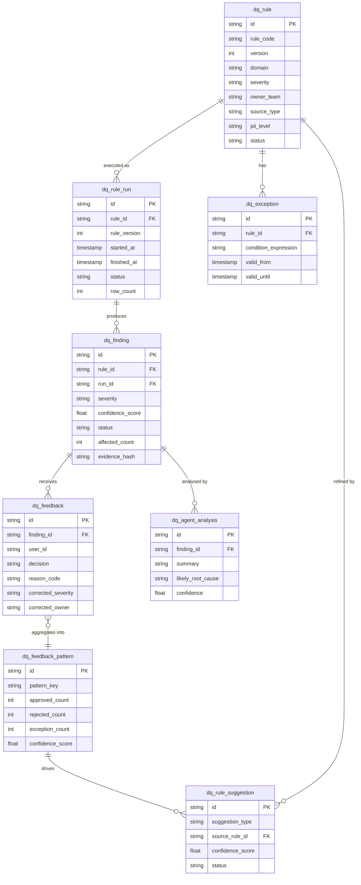
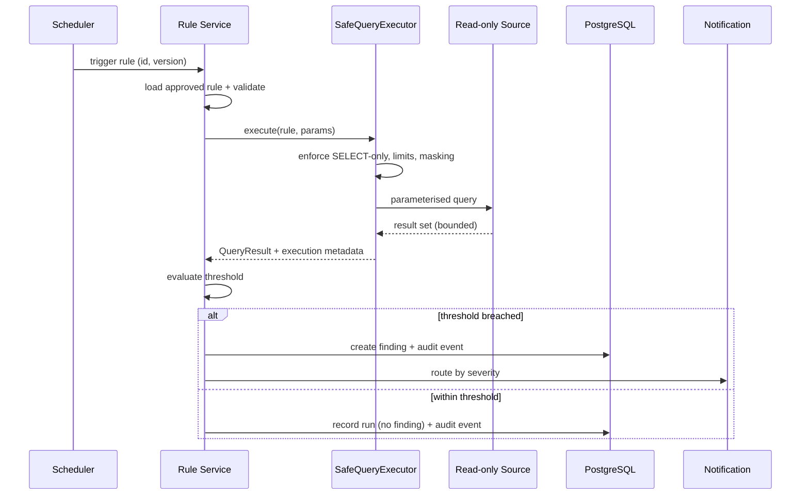
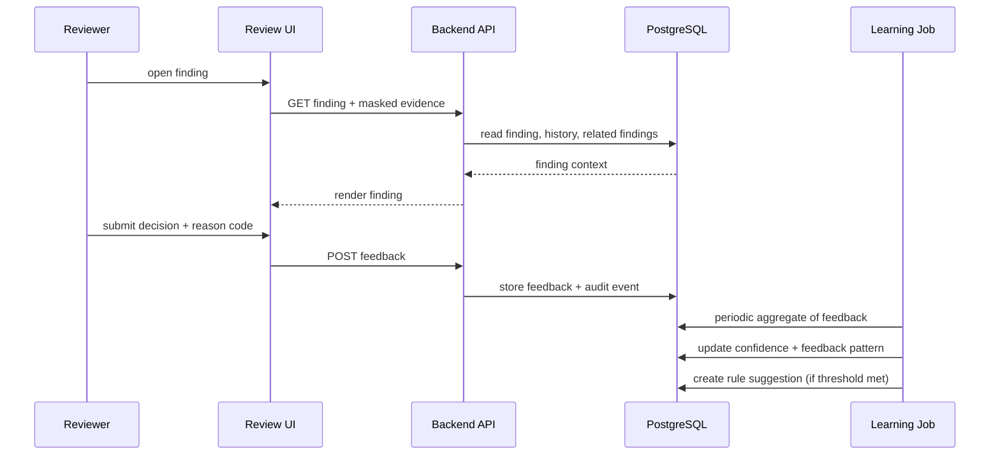

# Supporting Technical Detail

**Parent page:** Cerberos Data Assurance Intelligence Layer - Initial Discovery Concept
**Status:** Private working draft
**Purpose:** Concrete supporting artefacts for the PoC, consolidating the enhancement items listed under Open Decisions

This page collects the deliverable technical detail referenced as later enhancements. These artefacts are illustrative and must be validated against actual Cerberos data structures and governance requirements before use.

## Finding Evidence Model

Findings should store enough evidence for review and audit without becoming a raw data store.

Recommended evidence fields:

- Aggregate evidence, such as affected count, rate, baseline, threshold, and trend.
- Source and time window.
- Rule ID and rule version.
- Query execution ID or connector execution reference.
- Masked sample reference, if allowed by classification and governance.
- Baseline comparison.
- Related previous findings.
- Optional deployment, incident, or change references.

Raw rows should not be stored directly in findings. Where reviewers need deeper investigation, the finding should reference a governed evidence location or approved investigation workflow.

## Rule Lifecycle

```mermaid
flowchart LR
    draft["Draft rule"]
    technical["Technical review"]
    governance["Security and governance review"]
    approved["Approved"]
    scheduled["Scheduled execution"]
    findings["Findings generated"]
    feedback["Feedback collected"]
    suggestion["Suggestion created"]
    backtested["Backtested"]
    update["Approved update"]
    newversion["New rule version"]
    retained["Old version retained"]

    draft --> technical --> governance --> approved --> scheduled --> findings --> feedback --> suggestion --> backtested --> update --> newversion --> retained
```



## 1. Conceptual Data Model (ER Diagram)

The diagram below shows the core review-and-learning relationships. It is an illustrative subset;
the authoritative full table set (including `dq_metric_snapshot` and `dq_audit_event`) is defined in
**Rule Types, Data Model, and Examples**.



## 2. Rule YAML Validation Schema (JSON Schema)

A draft JSON Schema to validate rule files in CI before they are merged. It validates the single
canonical flat rule format used across the discovery pack (for example the rule examples in
**Rule Types, Data Model, and Examples** and **Technology Selection and Architecture Decision Report**):

```json
{
  "$schema": "https://json-schema.org/draft/2020-12/schema",
  "title": "Cerberos DQ Rule",
  "type": "object",
  "required": ["id", "version", "name", "domain", "severity",
               "source_type", "owner_team", "pii_level", "query", "threshold"],
  "additionalProperties": false,
  "properties": {
    "id": { "type": "string", "pattern": "^CERB-DQ-[0-9]{3,}$" },
    "version": { "type": "integer", "minimum": 1 },
    "name": { "type": "string", "minLength": 5 },
    "domain": { "type": "string" },
    "description": { "type": "string" },
    "severity": { "enum": ["LOW", "MEDIUM", "HIGH", "CRITICAL"] },
    "source_type": { "enum": ["replica_db", "athena", "metrics", "reporting"] },
    "source_name": { "type": "string" },
    "schedule": { "type": "string" },
    "query_type": { "enum": ["aggregate", "row", "reconciliation", "freshness"] },
    "owner_team": { "type": "string" },
    "escalation_team": { "type": "string" },
    "pii_level": { "enum": ["none", "masked_samples_only", "sensitive"] },
    "classification": {
      "type": "object",
      "additionalProperties": false,
      "properties": {
        "max_input_classification": {
          "enum": ["public_metadata", "internal_operational_metadata",
                   "sensitive_operational_data", "pii_identity_related",
                   "highly_restricted_investigation_only"]
        },
        "max_output_classification": {
          "enum": ["public_metadata", "internal_operational_metadata",
                   "sensitive_operational_data", "pii_identity_related",
                   "highly_restricted_investigation_only"]
        }
      }
    },
    "query": { "type": "string", "pattern": "^\\s*(?i:SELECT|WITH)\\b" },
    "threshold": {
      "type": "object",
      "required": ["expression"],
      "additionalProperties": false,
      "properties": { "expression": { "type": "string" } }
    },
    "result_limits": {
      "type": "object",
      "additionalProperties": false,
      "properties": {
        "max_rows": { "type": "integer", "maximum": 10000 },
        "timeout_seconds": { "type": "integer", "maximum": 120 }
      }
    },
    "evidence": {
      "type": "object",
      "additionalProperties": false,
      "properties": {
        "sample_mode": { "enum": ["none", "masked"] },
        "max_samples": { "type": "integer", "maximum": 100 },
        "include_baseline": { "type": "boolean" },
        "include_recent_deployments": { "type": "boolean" }
      }
    },
    "agent_action": {
      "type": "object",
      "additionalProperties": false,
      "properties": {
        "enabled": { "type": "boolean" },
        "allowed_actions": { "type": "array", "items": { "type": "string" } },
        "prohibited_actions": { "type": "array", "items": { "type": "string" } }
      }
    },
    "notification": {
      "type": "object",
      "additionalProperties": false,
      "properties": {
        "severity_routing": {
          "type": "object",
          "additionalProperties": false,
          "properties": {
            "CRITICAL": { "type": "string" },
            "HIGH": { "type": "string" },
            "MEDIUM": { "type": "string" },
            "LOW": { "type": "string" }
          }
        }
      }
    },
    "actions": {
      "type": "object",
      "additionalProperties": false,
      "properties": {
        "create_finding": { "type": "boolean" },
        "notify": { "type": "boolean" }
      }
    },
    "governance": {
      "type": "object",
      "required": ["requires_masking", "allow_raw_samples"],
      "additionalProperties": false,
      "properties": {
        "approved_by": { "type": "string" },
        "requires_masking": { "type": "boolean" },
        "allow_raw_samples": { "type": "boolean", "const": false },
        "requires_human_approval": { "type": "boolean" }
      }
    }
  }
}
```

Notes:

- This schema is the authoritative validation for the canonical flat rule format. The rule examples
  in **Rule Types, Data Model, and Examples** (`CERB-DQ-101`) and in
  **Technology Selection and Architecture Decision Report** (`CERB-DQ-001`) both validate against it.
- The `query` pattern enforces SELECT/WITH only at the schema layer; the `SafeQueryExecutor` remains the authoritative control.
- `allow_raw_samples` is constrained to `false` so raw PII cannot be enabled through a rule file.
- `max_rows` and `timeout_seconds` are capped to keep cost and load bounded.
- `additionalProperties: false` at every level keeps rule files tightly constrained; new fields must be added to the schema deliberately.
- The optional `classification` block lets each rule declare its maximum input and output data classification, aligned to the **Governance, Security, and Scale** data classification model. It is the machine-readable form of "each rule and finding should declare the maximum classification it may access and output".

## 3. Rule Execution Sequence



## 4. Review and Feedback Sequence



## 5. Confidence Score Calculation (Deterministic)

The PoC confidence score avoids ML and uses a transparent, auditable formula per rule (or per rule + source + event-type segment).

Definitions over a rolling window:

- `confirmed` = feedback decisions confirming a real issue.
- `rejected` = false-positive decisions.
- `exceptions` = known acceptable exception decisions.
- `total` = `confirmed + rejected + exceptions`.

Base precision:

```text
precision = confirmed / max(total, 1)
```

Volume-adjusted confidence using a smoothing constant `k` (e.g. 5) to avoid overconfidence on low samples:

```text
confidence = (confirmed + 1) / (confirmed + rejected + 2)      // Laplace-smoothed
support_weight = min(total / (total + k), 1.0)
confidence_score = round(confidence * support_weight, 2)
```

Interpretation:

| Score | Meaning | Suggested handling |
| --- | --- | --- |
| >= 0.80 | Reliable rule | Normal alerting |
| 0.50 - 0.79 | Mixed signal | Keep, monitor, review evidence |
| < 0.50 | High false-positive risk | Flag rule for owner review/refinement |

The score is recalculated by a scheduled job and stored on `dq_feedback_pattern`. It is an input to triage, never an automatic action.

## 6. Backtesting Methodology

Before any suggested rule refinement is deployed, it is backtested against historical data:

1. Select a historical window with available data (for example, the last 28 days).
2. Replay the candidate rule definition through `SafeQueryExecutor` in a read-only, shadow mode (no findings written to the live store).
3. Compare candidate findings against existing confirmed/rejected feedback for the same period.
4. Produce a backtest report:
   - `tested_windows`
   - `historical_findings`
   - `matched_confirmed_issues`
   - `likely_false_positives`
   - `missed_confirmed_issues`
5. A human owner reviews the report and approves, rejects, or requests changes.
6. Only approved, versioned rules are deployed; the previous version remains available for rollback.

Shadow mode is mandatory: a candidate rule must never write to the live findings store or trigger notifications during backtesting.

## 7. Notification Templates

### Teams / Slack (High or Critical)

```text
[Cerberos DQ] {severity} finding in {domain}
Rule: {rule_name} (v{rule_version})
Source: {source_system}
Affected: {affected_count} records in {time_window}
Baseline: {baseline_value} | Current: {current_value}
Confidence: {confidence_score}
Review: {review_url}
```

### Email (digest item)

```text
Subject: [Cerberos DQ] Daily assurance digest - {date}

{count_critical} critical, {count_high} high, {count_medium} medium findings.

Top findings:
- {rule_name} | {domain} | {source_system} | {affected_count} | {review_url}
...

Full dashboard: {dashboard_url}
This is an automated assurance summary. No action is taken automatically.
```

### Jira / ServiceNow (ticket body)

```text
Summary: [DQ][{severity}] {rule_name} - {domain}
Description:
  Finding ID: {finding_id}
  Rule: {rule_name} (v{rule_version})
  Source: {source_system}
  Affected count: {affected_count}
  Time window: {time_window}
  Evidence (masked): {evidence_reference}
  Suggested owner: {owner_team}
Labels: cerberos, data-assurance, {domain}
```

All templates use masked references only. Raw PII must never appear in a notification.

## 8. Agent Prompt Template and Guardrails

When the optional `AgentAnalysisService` is enabled, the agent receives only structured, masked context.

System prompt skeleton:

```text
You are a data assurance analysis assistant for the Cerberos platform.
You receive structured, masked data quality finding metadata.
You must:
- Summarise the finding in plain language.
- Suggest likely root-cause hypotheses (clearly labelled as hypotheses).
- Suggest a candidate owner team from the provided list only.
You must NOT:
- Request or infer raw PII.
- Recommend or perform any data modification.
- Make operational or security decisions.
- Output anything other than the requested structured fields.
All output is advisory and subject to human review.
```

Input contract (masked):

```json
{
  "finding_id": "dq-finding-...",
  "rule_name": "Missing critical identity fields",
  "domain": "passenger-identity",
  "source_system": "CarrierGateway-A",
  "severity": "HIGH",
  "affected_count": 847,
  "baseline": "0.3%",
  "current": "7.2%",
  "recent_deployments": ["transform-v2.14"],
  "candidate_owner_teams": ["ingestion-platform-team", "identity-data-platform"]
}
```

Guardrails enforced outside the model:

- Input is built from masked finding metadata only; no raw rows are passed.
- Output is parsed into a typed `AgentAnalysis` object; free text is length-limited.
- Prompt and response are written to the audit log.
- The agent endpoint must be an approved enterprise LLM gateway.

## 9. Integration Test Scenarios (PoC)

| # | Scenario | Expected result |
| --- | --- | --- |
| 1 | Approved rule executes against replica and breaches threshold | Finding created, audit event written, notification routed by severity |
| 2 | Approved rule executes and stays within threshold | Run recorded, no finding, no notification |
| 3 | Rule query containing `UPDATE`/`DELETE` submitted | Rejected by SafeQueryExecutor, no execution, audit event written |
| 4 | Query exceeds timeout or row limit | Execution aborted, run marked failed, no partial finding persisted |
| 5 | Connector to source unavailable | Run marked failed, health check reflects unhealthy, alert raised |
| 6 | Reviewer confirms a finding | Feedback stored, confidence pattern updated on next learning run |
| 7 | Reviewer marks false positive | Confidence score decreases for that rule segment |
| 8 | Learning job detects high false-positive rate | Rule suggestion created with status `pending_review` |
| 9 | Suggested refinement backtested | Backtest report produced; no writes to live findings store |
| 10 | Finding evidence requested | Only masked samples returned; raw PII never exposed |

## 10. Data Quality Tooling Comparison

A focused comparison for the "build vs reuse" decision deferred in the main report.

| Tool | Strengths | Gaps for this concept |
| --- | --- | --- |
| Great Expectations | Rich expectation library, validation, docs generation | No governed human-feedback learning loop or review workflow |
| Deequ (Spark) | Scales on large datasets, constraint suggestions | Spark dependency; no review/feedback model; JVM but batch-oriented |
| Soda (Soda Core/SodaCL) | Readable checks language, scheduling, alerting | Feedback-driven rule evolution and audit governance not native |
| dbt tests | Simple, integrates with transformation layer | Limited to warehouse transforms; no finding review workflow |
| AWS Glue Data Quality | Managed, DQDL rules, AWS-native | Less suited to human-in-the-loop learning and custom governance |

Conclusion: the PoC should validate whether existing tools can be reused for the rule execution
layer, while the custom part stays focused on the governed learning loop (reviewed findings,
structured feedback, confidence, exception discovery, human-approved evolution), which is not native
to these tools. This keeps the build vs reuse decision open and evidence-led rather than assuming a
custom platform up front.

## Glossary

The shared terminology for this discovery pack is maintained on its own page: **Glossary**.
